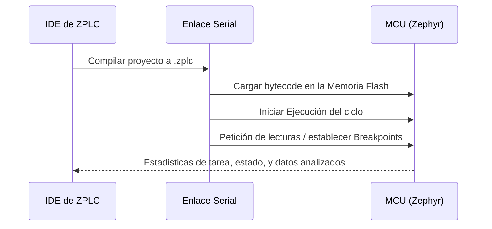

# Despliegue y Sesiones de Ejecución

Esta página cubre el flujo de trabajo para desplegar y depurar lógica funcional desde el IDE de ZPLC hacia sus entornos compatibles.

## Entornos de Ejecución Disposición

ZPLC ofrece dos principales entornos de ejecución compatibles:

| Target | Adapter Utilizado | Uso Típico |
|---|---|---|
| **Simulación Nativa (SoftPLC)** | `NativeAdapter` | Validar control de flujo numérico a velocidad nativa en la PC en paralelo. |
| **Controlador de Hardware** | `SerialAdapter` | Subida de programa, ejecución e introspección en tarjetas de hardware basadas en Zephyr RTOS. |

## Flujo de Trabajo en Simulación Nativa

Cuando corres el IDE de ZPLC desde aplicación de escritorio, al dar click en **Start Simulation** inicia un SoftPLC POSIX en segundo plano asíncrono. El IDE se mantiene en modo visualizado sobre este SoftPLC nativo.
Te permite depurar lógica IEC 61131-3 sin contar obligatoriamente con una tarjeta microcontroladora. Sirve vitalmente para depurar cálculos lógicos, FBD combinatorios densos y matemáticas algorítmicas veloces.

## Flujo de Trabajo en Hardware Físico

En fases de puesta a punto o ensamble final, el canal de `SerialAdapter` asume la responsabilidad física sobre el cordón físico entre el PC y el MCU (A través de Serioal).
Responsabilidades:
- Administrar anchos de banda a nivel de baudios o ruteos serial.
- Transmitir de forma binaria el bytecode `.zplc` directamente al chip o al NVS interno.
- Provisionar cabeceras y detalles de configuración nativos.
- Extracción de metadata vital y estado de la red o sensores a través de sondas internas e imprimirlas en las **Watch Tables** del IDE.
- Accionar comandos del usuario durante el debug, tal como pausar, step, y valores *forced*.

### Ciclo de Vida del Despliegue

## Configuración y Solución de Problemas de Despliegues

Cuando una descarga presenta problemas ante conexiones en hardware, verifica los listados base:
1. **Target Real** — Revisa tu manifiesto activo `zplc.json` indicando el microcontrolador activo si coincide con el objeto montado o puente en la placa MCU base.
2. **Puerto COM/Serial** — Asegúrate que el cable u hub detectan el TTY correctamente asignado en su OS evitando que herramientas terceras monopolizen el uso.
3. **Firmware Preparatorio** —  Para que se establezca la respuesta en comunicación, el MCU debe tener cargado el boot de Zephyr del runtime Core de ZPLC anticipadamente; para recibir tus inyecciones automatas de lógica en base IEC 61131-3 sin requerir recompilaciones posteriores por C.
