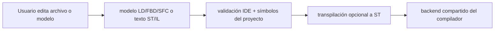

# Editores Visuales y de Texto

El IDE expone superficies de autoría text-first y model-first.

Eso importa porque el claim del release habla de **workflow soportado**, no de extensiones de archivo aisladas.

## Editores de texto

Las superficies text-first cubren:

- `ST`
- `IL`

Estos editores alimentan directamente el pipeline definido en `packages/zplc-ide/src/compiler/index.ts`.

## Editores respaldados por modelos

Las superficies model-first cubren:

- `LD`
- `FBD`
- `SFC`

El IDE mantiene parsers/modelos dedicados para esos lenguajes y luego los transpila a ST antes de generar bytecode.

## Arquitectura editorial

## Ladder Diagram (LD)

`LD` se edita como modelo y luego se normaliza por el camino de transpilation.

Lo importante para v1.5 es conservar:

- topología del rung
- bindings de símbolos
- mapeo determinista al contrato compartido de compilación

`languageWorkflow.test.ts` ya incluye un modelo LD canónico que demuestra que este camino compila por el backend compartido.

## Function Block Diagram (FBD)

`FBD` es el ejemplo más claro del límite IDE/compilador:

- el editor maneja ubicación de bloques y conexiones
- el transpiler convierte eso a una forma ST compilable
- el runtime sigue ejecutando `.zplc`, no un backend FBD separado

## Sequential Function Chart (SFC)

`SFC` se representa como modelo de pasos, transiciones y acciones.

El punto arquitectónico importante es:

- la autoría SFC está soportada en el IDE
- el comportamiento se normaliza antes de ejecutar
- el runtime sigue siendo bytecode-oriented

## Responsabilidades compartidas

Todos los editores tienen que alinearse con el mismo modelo de proyecto:

- acceso a símbolos del proyecto
- compilación por el backend compartido
- compatibilidad con debug maps cuando el workflow lo reclama
- comportamiento consistente al cambiar entre simulación y hardware

## Orden de lectura recomendado

1. esta página para las superficies de autoría
2. [Workflow del compilador](./compiler.md)
3. [Lenguajes y modelo de programación](../languages/index.md)
4. [Despliegue y sesiones de runtime](./deployment.md)
