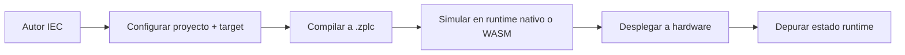

# IDE y Herramientas

El IDE es la superficie de ingeniería que tiene que demostrar que ZPLC v1.5.0 es un producto coherente y no solo un compilador con linda cara.

## Qué le toca al IDE

- modelo de proyecto basado en `zplc.json` y archivos reales
- workflows de lenguaje para `ST`, `IL`, `LD`, `FBD` y `SFC`
- compilación a través del backend compartido `@zplc/compiler`
- adapters de runtime para simulación WASM, simulación nativa y hardware real
- operaciones de debug como breakpoints, watch, force values e inspección de estado

## Workflow end-to-end

## Modelo de proyecto

El proyecto del IDE es intencionalmente transparente:

- `zplc.json` guarda metadata, target, red, I/O, comunicación y tareas
- los archivos fuente siguen siendo archivos comunes del proyecto
- si el navegador soporta File System Access API, el IDE trabaja contra carpetas reales
- si no, puede usar proyectos virtuales en memoria

Eso está reflejado en `packages/zplc-ide/src/store/useIDEStore.ts` y en los tipos compartidos de `packages/zplc-ide/src/types/index.ts`.

## Targets de runtime que expone el IDE

| Camino | Adapter | Propósito | Guía de release |
|---|---|---|---|
| simulación en navegador | `WASMAdapter` | feedback rápido en browser | útil, pero degradado para paridad de pause/resume/step/breakpoints |
| simulación nativa desktop | `NativeAdapter` | sesión host respaldada por Electron | camino preferido para paridad de simulación en release |
| runtime en hardware | `SerialAdapter` | carga, ejecución y debug sobre Zephyr real | camino autoritativo para validación de placas y HIL |

`createSimulationAdapter()` selecciona simulación nativa si existe el bridge de Electron; si no, cae a WASM.

## Modelo de depuración

La depuración es consciente de capacidades, no ingenua.

- la simulación nativa publica un perfil de capacidades
- el hardware deriva estado desde el runtime y los comandos de debug por serial
- WASM queda disponible, pero explícitamente marcado como fallback degradado

## Seguí por acá

- [Arquitectura y modelo de proyecto del IDE](./overview.md)
- [Editores visuales y de texto](./editors.md)
- [Workflow del compilador](./compiler.md)
- [Despliegue y sesiones de runtime](./deployment.md)
- [Lenguajes y modelo de programación](/languages)

## Límite de release

La versión del paquete del IDE alineada con esta reescritura es `1.5.0` en `packages/zplc-ide/package.json`.

Eso NO reemplaza los gates humanos del release: la credibilidad final sigue dependiendo de la matriz de evidencia en `specs/008-release-foundation/artifacts/release-evidence-matrix.md`.
