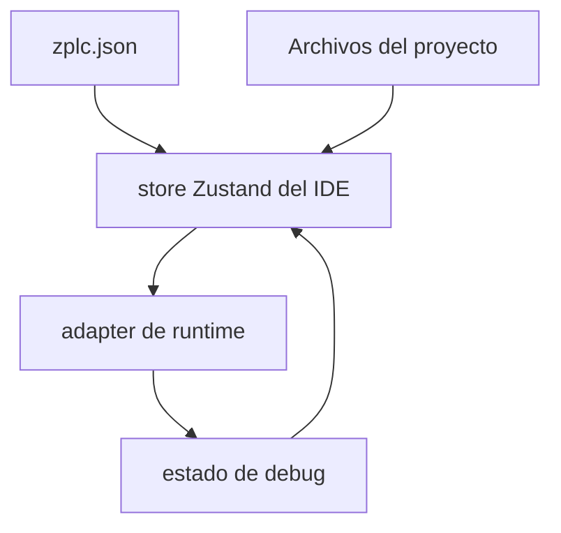
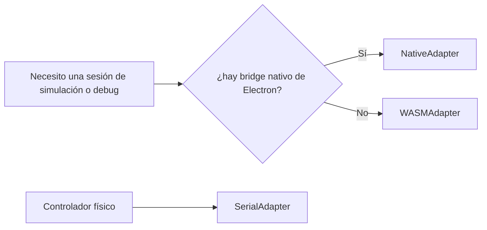

# Arquitectura y Modelo de Proyecto del IDE

Esta página explica cómo está armado hoy el IDE usando fuentes del repositorio, no humo de brochure.

## Límites de paquetes

- `packages/zplc-ide` — UI, estado del proyecto, adapters de runtime, despliegue, debug
- `packages/zplc-compiler` — parser, transpilers, generación de bytecode, stdlib, debug maps

## Modelo de estado del proyecto

`useIDEStore.ts` muestra el modelo real de trabajo del IDE.

El store mantiene:

- archivos cargados y tabs abiertos
- estado de conexión
- estado del controlador/runtime
- debug map, breakpoints, watch variables y forced values
- layout del editor y estado de UI

## Qué vive en `zplc.json`

Los tipos compartidos muestran que el proyecto puede definir:

- `target`
- `network`
- `io`
- `communication`
- `tasks`

Eso hace que el modelo del IDE sea portable, auditable y amigable con Git.

## Proyectos de navegador, desktop y virtuales

| Contexto | Comportamiento base | Para qué sirve |
|---|---|---|
| carpeta real | File System Access API | edición persistente sobre un directorio real |
| proyecto virtual/ejemplo | estado en memoria | fallback para browsers sin soporte o ejemplos embebidos |
| proyecto desktop | Electron + filesystem local | workflow más fuerte para uso release-facing |

## Conocimiento del target desde el manifiesto de placas

`packages/zplc-ide/src/config/boardProfiles.ts` importa directamente `firmware/app/boards/supported-boards.v1.5.0.json`.

Eso evita que el IDE invente una segunda fuente manual para labels, capacidades de red o tipos de placa.

## Modelo de sesiones de runtime

El IDE exporta tres adapters principales:

- `WASMAdapter`
- `NativeAdapter`
- `SerialAdapter`

## Depuración consciente de capacidades

El IDE no asume que todas las sesiones exponen el mismo nivel de control.

- nativo publica un perfil de capacidades
- hardware deriva estado desde el runtime y comandos shell/debug
- WASM marca pause/resume/step/breakpoints como degradados

Eso es exactamente lo que querés en una herramienta industrial seria: que diga la verdad sobre lo que puede garantizar.

## Siguiente lectura

- [Editores visuales y de texto](./editors.md)
- [Workflow del compilador](./compiler.md)
- [Despliegue y sesiones de runtime](./deployment.md)
