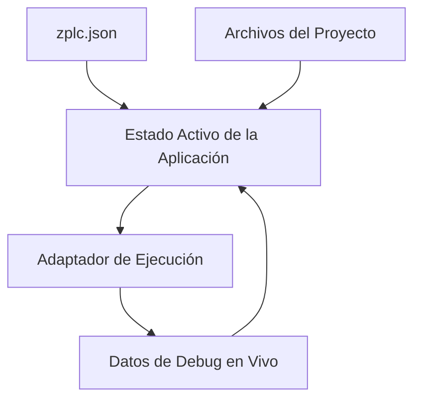

# Arquitectura y Modelo de Proyecto del IDE

El IDE de ZPLC se basa en una estricta separación de responsabilidades para proporcionar una experiencia de desarrollo moderna y de alta capacidad de respuesta.

## Límites entre Paquetes (Packages)

Las herramientas de ZPLC están divididas en dos áreas lógicas bajo el capó:
- **`@zplc/ide`** — La interfaz de usuario, gestión de estado del proyecto, editores de código, adaptadores de simulación y flujos de despliegue.
- **`@zplc/compiler`** — El motor subyacente que maneja el parseo, la transpilación de lenguajes visuales a ST, la emisión de bytecode, la resolución de la biblioteca estándar y la generación de mapas de depuración.

Esta separación asegura que el compilador se pueda ejecutar de manera oculta (headless) en canales CI/CD para integraciones, mientras que el IDE gestiona la orquestación de la UI visual de manera independiente.

## Modelo de Estado de la Aplicación

El IDE utiliza una arquitectura de estado robusta y reactiva internamente para manejar proyectos industriales complejos sin problemas.

## Configuración del Proyecto: `zplc.json`

El archivo `zplc.json` es el corazón de cualquier proyecto ZPLC. Define de forma declarativa todo el alcance de la automatización:

- `target` — Selección de placa de hardware, CPU y restricciones de reloj requeridas.
- `network` — Credenciales Wi-Fi o configuraciones IP Ethernet.
- `io` — Mapeos fijos (hardcodeados) entre pines físicos del chip y variables lógicas.
- `communication` — Ajustes de brokers MQTT, IDs de nodos Modbus y enrutamiento remoto global.
- `tasks` — Declaración de tareas Cíclicas/Por eventos, velocidades de intervalo, prioridades y registro del ruteo.

## Sensibilidad al Entorno (Target Auto-Awareness)

Cuando seleccionas un target de hardware en la configuración, el IDE importa automáticamente el manifiesto de capacidades de dicha placa física.
Significa que la base de datos de ZPLC evita que asocies puertos de red integrados a proyectos en chips como el Arduino MCU (el cual solo goza de una UART simple), o impedir que indiques puertos físicos de E/S irreales donde dichas patillas no operan. Opciones irrealizables como conectividad en placas rudimentarias y asignamientos no nativos desaparecen inteligentemente de los menús contextuados de la vista visual del proyecto y autocompletado del código.
