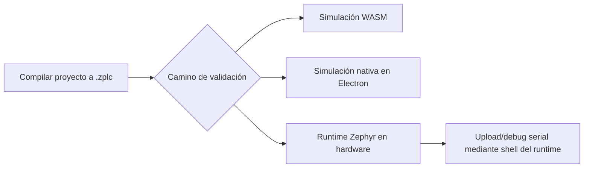

# Integración y Despliegue

Esta página conecta la historia de primeros pasos con la historia real de integración del runtime.

Responde una pregunta práctica: una vez que ya tenés un programa `.zplc`, ¿cómo llega a un
target runtime real sin fingir que placas o transportes no soportados ya están listos para release?

## Soporte de Plataforma

ZPLC sigue siendo portable, pero el alcance público de v1.5 es mucho más chico que “todo lo que Zephyr podría soportar”.

El soporte real de v1.5 debe leerse desde el manifiesto de placas soportadas y la
evidencia del release, no desde una lista fija en esta pagina.

## Flujo de integración

## Integración de ZPLC

La integración de ZPLC en una placa Zephyr personalizada implica:

1.  **Incluir la Biblioteca**: Añada `libzplc_core` a su compilación CMake.
2.  **Implementar la HAL**: Proporcione implementaciones específicas para las interfaces de hardware requeridas (`zplc_hal_*`) definidas en `docs/docs/runtime/hal-contract.md`.
3.  **Inicializar el Core**: Llame a las funciones de inicialización desde su aplicación `main()` de Zephyr.

Para el runtime de referencia que trae este repositorio, no arrancás desde cero. Arrancás desde
`firmware/app`, que ya empaqueta el core, el scheduler, el workflow shell, soporte de persistencia
y assets de configuración por placa.

## Flujos de Trabajo de Despliegue

Una vez que el runtime está integrado en un dispositivo, el despliegue de la lógica se gestiona a través del IDE:

1.  **Despliegue Serie**: Para desarrollo local, el IDE puede transferir archivos `.zplc` por una conexión serie cuando la ruta placa/runtime elegida expone ese flujo serial.
2.  **Despliegue de Red**: Tratá cualquier despliegue orientado a red como algo específico de la placa y de la evidencia, no como una promesa general de v1.5 para cualquier target.

Más concretamente, la verdad actual del repo dice:

- la conexión navegador/hardware usa el adapter serial / flujo WebSerial
- el desktop con Electron agrega un bridge de simulación nativa, no un nuevo contrato mágico de transporte a hardware
- la gestión de programas y el control de debug del runtime hardware se exponen mediante los comandos de shell Zephyr documentados en `firmware/app/README.md`

*Nota: Para guías detalladas de implementación de HAL, consulte la [Documentación del Runtime](../runtime/index.md).*

## Expectativas de Configuracion de Protocolos

- use MQTT solo en placas cuyo perfil soportado exponga una ruta real de red;
- use Modbus TCP solo cuando la placa y el runtime soporten transporte de red;
- use Modbus RTU solo cuando la placa y el firmware expongan la ruta serial requerida;
- mantenga alineados la configuracion del proyecto, la documentacion y la evidencia del release.

La prueba HIL humana representativa para caminos seriales y de red sigue estando fuera del claim set público y todavía está pendiente.

## Flasheo y realidad específica por placa

Los comandos de build están canonizados en el manifiesto de placas soportadas. El flasheo sigue siendo específico por placa.

- muchas placas pueden usar `west flash`
- los targets tipo RP2040 pueden requerir copiar un artefacto UF2 generado al volumen de la placa

Por eso la documentación reparte las responsabilidades así:

- [Placas Soportadas](../reference/boards.md) es dueña de los facts de placas y assets de soporte
- [Configuración del Workspace Zephyr](../reference/zephyr-workspace-setup.md) es dueña de la forma canónica del workspace/build
- esta página es dueña del handoff entre la salida del proyecto y el target runtime
