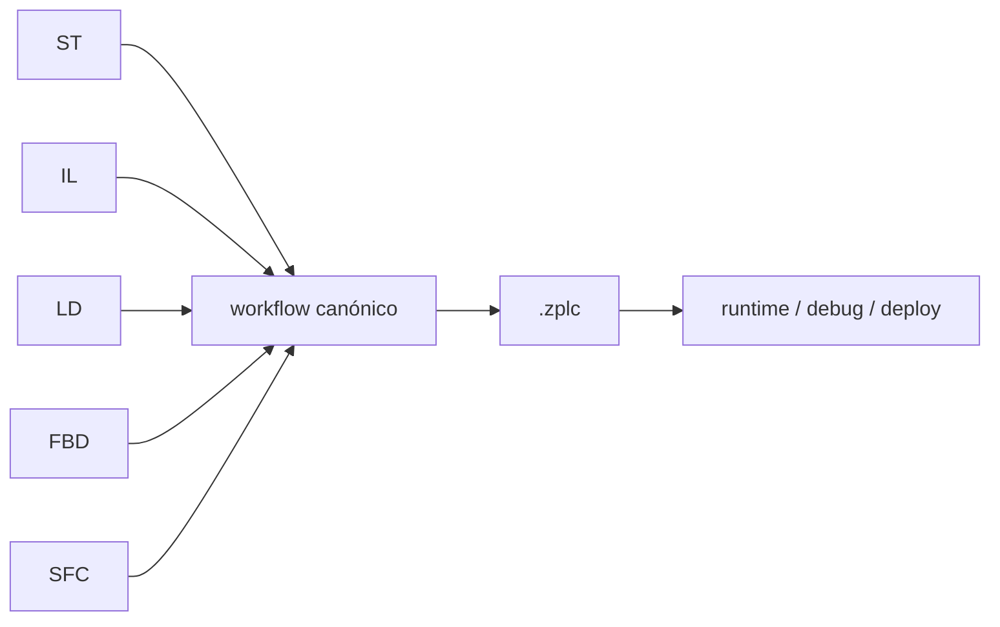

# Suite de Lenguajes v1.5

Esta página define las muestras canónicas de workflow usadas para respaldar el claim de v1.5 para `ST`, `IL`, `LD`, `FBD` y `SFC`.

La referencia de gate para este claim es `REL-002` en `specs/008-release-foundation/artifacts/release-evidence-matrix.md`, que hoy sigue **pendiente** de validación humana final de debug/desktop.

## Comportamiento compartido

Cada muestra de esta suite prueba el mismo comportamiento a nivel workflow:

- autoría en la ruta de lenguaje reclamada
- compilación exitosa a `.zplc`
- soporte de simulación
- soporte de despliegue
- soporte de depuración



La forma lógica canónica es intencionalmente chica:

- una condición de arranque
- una salida temporizada
- una vinculación visible a salida

## Structured Text (ST)

```st
PROGRAM WorkflowST
VAR
    Start : BOOL := TRUE;
    Timer : TON;
    Out1 : BOOL := FALSE;
END_VAR
Timer(IN := Start, PT := T#250ms);
Out1 := Timer.Q;
END_PROGRAM
```

## Instruction List (IL)

```iecst
PROGRAM WorkflowIL
VAR
    Start : BOOL := TRUE;
    Timer : TON;
END_VAR
VAR_OUTPUT
    Out1 AT %Q0.0 : BOOL;
END_VAR
    LD Start
    ST Timer.IN
    CAL Timer(
        PT := T#250ms
    )
    LD Timer.Q
    ST Out1
END_PROGRAM
```

## Ladder Diagram (LD)

`LD` usa la ruta del modelo visual. El rung canónico expresa `Start -> Out1` y debe compilar, simular, desplegar y depurar a través del mismo flujo de tareas que `ST`.

## Function Block Diagram (FBD)

`FBD` usa la ruta del modelo visual. El diagrama canónico conecta un bloque de entrada con uno de salida a través del camino estándar de transpilation.

## Sequential Function Chart (SFC)

`SFC` usa un paso inicial y una acción que activa la salida. El claim de release no depende de un backend separado: depende del mismo workflow end-to-end verificado.

## Cómo usar esta página en el release

Esta página define la muestra canónica del claim. No reemplaza:

- tests automatizados del compilador/IDE
- evidencia desktop humana
- evidencia HIL cuando el gate lo requiera

Mientras `REL-002` siga pendiente, la suite respalda el diseño del claim, pero no debe presentarse como sign-off humano final.
