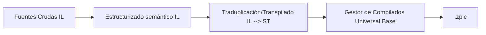

# Lista de Instrucciones (IL)

Instruction List (IL) es el lenguaje de programación textual y plano estandarizado de bajo perfil amparado por IEC 61131-3 y compatibilizado dentro de ZPLC.
Funciona estrictamente apilando datos analíticos contra la memoria simulada emulando acumuladores del propio microprocesador ensamblador base subyacente.

## La Ejecución Integral

Trabajando Instruction List sobre un framework ZPLC asume características poderosas alejándole del entorno arcaico al que este paradigma solía estar confinado. Posee un robusto y moderno ruteo directo sobre la plataforma del IDE con flujos estandarizados para uso industrial.

Al clickear en Iniciar Compilación bajo el panel, la máquina tomará sus directrices explícitas en modelo fuente para parsearlas y trasladarlas interlinealmente a Texto Estructurado Puntero (ST). Ya preparado y lógicamente igual asume su trayecto sobre el motor unísono generando opcodes y Bytecodes optimizado (`.zplc`) capaz de alojarse sin pérdida por overhead dentro del Zephyr en la Memoria RAM y ROM de destino.



## Beneficio Subyacente

Generando IL directamente englobado sobre cadenas universales homólogas a la rama ST de diagramas, se propician bondades instantáneas:
- Acceso indiscriminado o pleno uso sobre la Stdlib Standard (Matemática, Timers o Contabilizadoras industriales) mediante funciones integradas por IL (CAL / ST).
- Cero degradación. Al descender hasta códigos bases nativos corren con perfiles exactos de consumo en ciclos CPU C-Kernel Zephyr tal cual algoritmos pesados en texto libre directo ST.
- Posibilidad completa de inyectar breakpoints en línea directa y parar ciclos, inyectar watch variables y emular sin requerir herramientas extra sobre entorno nativo POSIX a nivel PC.

## Script Orientativo: Temporización de Señales en IL

Las demostraciones abajo marcan sentencias funcionales estándar; El arranque e inyección directa (`TON` y Evaluación Start) interactúan marcando un Output final validando y reteniendo las cargas binarias en los ciclos correctos:

```iecst
PROGRAM WorkflowIL
VAR
    Start : BOOL := TRUE;
    Timer : TON;
END_VAR
VAR_OUTPUT
    Out1 AT %Q0.0 : BOOL;
END_VAR

    LD Start
    ST Timer.IN
    CAL Timer(
        PT := T#250ms
    )
    LD Timer.Q
    ST Out1
END_PROGRAM
```

## Exploración Completa

- [Ecosistema de Múltiples Lenguajes ZPLC](./index.md)
- [Fundamentos de Texto Estructurado (ST)](./st.md)
- [Funciones IEC Incorporadas en Standard Library](./stdlib.md)
- [Casos Comunes en Lenguajes V1.5 Suite ZPLC](./examples/v1-5-language-suite.md)
