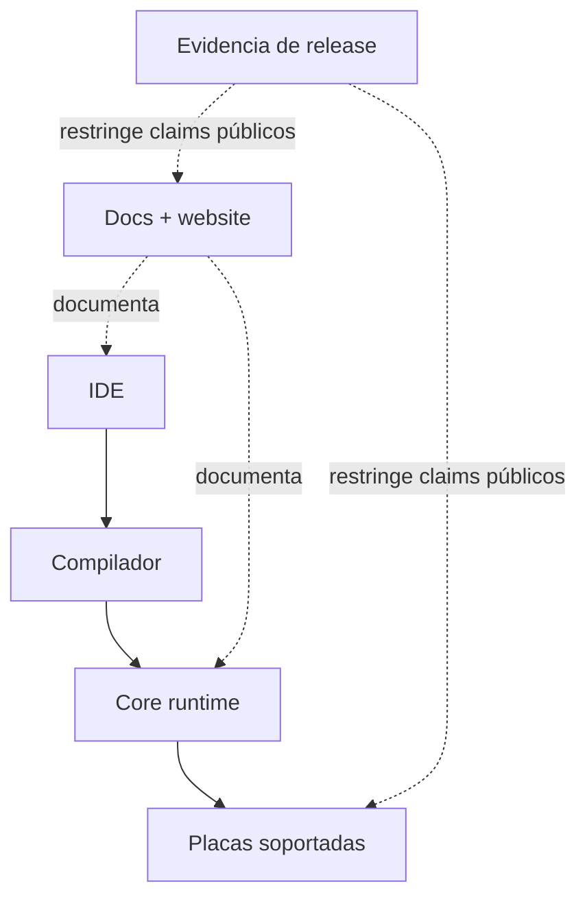

# Visión General de la Plataforma

ZPLC (Zephyr PLC) es una plataforma determinista orientada a IEC 61131-3 que combina un core
de ejecución portable con una toolchain moderna de ingeniería.

Para v1.5.0, la idea importante es ésta: ZPLC no es solo “una VM” ni solo “un IDE”.
Es el sistema combinado de docs, compilador, IDE, runtime, soporte de placas y evidencia del release.

## Mapa del producto

## Conceptos Centrales

*   **Determinismo**: Los tiempos de ejecución predecibles no son negociables. ZPLC está construido sobre Zephyr RTOS, asegurando un comportamiento en tiempo real.
*   **Portabilidad**: "Un único núcleo de ejecución, cualquier runtime". La máquina virtual principal (escrita en C) está desacoplada del hardware a través de una estricta Capa de Abstracción de Hardware (HAL).
*   **Seguridad**: Construido desde cero con principios seguros, orientado a un despliegue robusto en entornos industriales.
*   **Experiencia de Desarrollo Moderna**: Un IDE basado en web (usando React, TypeScript y Monaco) trae los flujos de trabajo de desarrollo de software estándar (Git, CI/CD) a la programación de PLC.

## Límites del Producto

ZPLC consta de varios subsistemas distintos:

1.  **Máquina Virtual Central (Core VM) (`firmware/lib/zplc_core`)**: El intérprete de bytecode C99. Maneja la programación (scheduling), la gestión de tareas y la ejecución de la lógica compilada. Tiene cero dependencias de hardware específico.
2.  **Capa de Abstracción de Hardware (HAL)**: El contrato que permite que la VM central se ejecute en varios objetivos (por ejemplo, STM32, ESP32, POSIX).
3.  **Compilador (`packages/zplc-compiler`)**: Traduce caminos de lenguaje IEC al bytecode `.zplc`.
4.  **IDE (`packages/zplc-ide`)**: Autoría, compilación, simulación, despliegue y depuración para los workflows de lenguaje reclamados.
5.  **Runtimes de Destino**: Compilaciones de firmware específicas que combinan la VM central, una implementación HAL y un RTOS (generalmente Zephyr).

## Cómo recorren la plataforma los usuarios

El camino de mayor valor para un usuario suele ser:

1. entender los límites del release en la documentación
2. crear o abrir un proyecto `zplc.json` en el IDE
3. escribir lógica en uno de los workflows de lenguaje soportados
4. compilar a `.zplc`
5. validar en simulación WASM o nativa
6. pasar a hardware soportado cuando hace falta prueba real en embebido

## Límites del release v1.5

La base del release se considera real solo cuando:

- las placas soportadas salen de un único manifiesto canónico;
- los workflows de lenguaje reclamados tienen automatización y docs coherentes;
- las features de protocolos tienen evidencia en runtime, compilador, IDE y docs;
- los claims de desktop y HIL tienen prueba humana, no solo presencia de código.

## ¿Por qué ZPLC?

Los PLC tradicionales a menudo encierran a los usuarios en ecosistemas propietarios y herramientas de desarrollo obsoletas. ZPLC proporciona una alternativa abierta y moderna que aprovecha microcontroladores estándar mientras se adhiere al estándar establecido IEC 61131-3 para la lógica de automatización.

## Seguí por acá

- [Primeros Pasos](/getting-started)
- [Arquitectura del Sistema](/architecture)
- [Visión General del Runtime](/runtime)
- [Integración y Despliegue](/integration)
