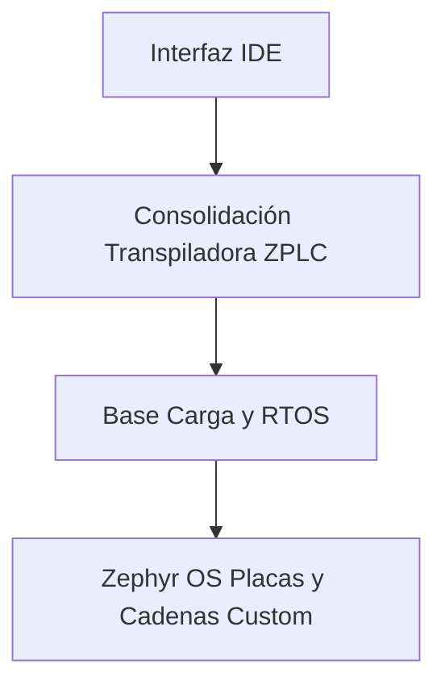

# Mapas de Plataforma 

ZPLC es una plataforma lógica compatible IEC 61131-3 centrada al determinismo estricto, combinando portabilidad en su ejecución por un core virtual `VM` basado íntegramente de librerías ANSI C, con una cadena moderna visual basada fuertemente en software desktop host (Su sistema y PC/Mac).

## El Ecosistema Integral

ZPLC representa una suite completa, fuertemente amalgamada y diseñada para escalar verticalmente entre herramientas visuales a bases metálicas de baja energía.

## Sus Pilares Esenciales

- **Determinismo Estricto Absoluto**: Predicción del uso y velocidad matemática inamovible para líneas de tracción automotriz. Asigna memorias rígidamente evitando fluctuaciones (Sin asincronías JS o Garbage Collection) y programando hardware directo a metrónomo.
- **Migración a Placas Múltiples**: Acuñado hacia una frase fuerte: "Bajo Ejecución Única, Entornos Diferentes". La Maquina Principal nunca choca con controladores y permite saltos asombrosos portando lógicas creadas sin alterarlas; saltando por HW sin reescribir su script y su ingeniería IEC base.
- **Independencia Real Comercial (Sin Vendor Lock-In)**: Desanclado orgánicamente usando sistemas amparados globalizados basados en proyectos Open Souce (Zephyr Base). Flasheos pueden operar por ARM básicos de STM32 Series y hasta arquitecturas modernas como ESP32, sin la penalización pesada o sobrecosto monetario por licencias a pagar de marca privativa en su HW industrial.

## Componentes y Fronteras Técnicas

Para el ensamblado final, ZPLC despliega varios segmentos independientes:

1. **Kernel y Computo Virtual `libzplc_core`**: Enlazador byte a byte C99 puro para gestionar el multi-threading cíclico veloz. Comprobación constante de topes y estándares, carente y ciego funcionalmente con todo el sustrato hardware en donde anide.
2. **Capa HAL Contract**: Traductores en "espejo", un adaptador virtual al que su hardware Zephyr de bajo entorno escucha. Brinda puertas físicas al hardware simulando temporizadores `Sleep` o activando patillaje y relés para las funciones estándar del núcleo inmovilizado.
3. **Consolidador-Compilador (Transpiler/Compiler)**: Su función magna es asimilar lenguajes gráficos en flujos abstractos nativos al chip. Transforma diagramas a bytecodes empaquetándolo velozmente y logrando compatibilidades de depuración.
4. **Programa Generalizado y Frontend Desktop `IDE`**: Entorno en donde el maquinista y estructurador vivencian al ZPLC. Generador visual, conectores seriales puros `COM` o puenteador para monitoreos y visualización de relés encendiéndose local o remoto por sondas digitales online en ejecución ininterrumpida.

## Puesta a Marcha Típica

El proceder normal que afrontará en planta o taller el arquitecto o ingeniero industrial a cargo operará:

1. Iniciar un árbol bajo un manifiesto puro en ZPLC asignándoles sus prioridades al archivo de variables `zplc.json`.
2. Trazar líneas, contactos lógicos e interruptores y codificar sus fórmulas en PASCAL-like y diagramados estándar clásicos o inter-mistas (ST/FBD/LD).
3. Evaluar e iniciar test compilables y emitir código puro comprimido `.zplc`.
4. Visualizar mediante simuladores puros y Nativos POSIX los resultados desde su misma netbook, revisando integridades boolean y test de latencias matemáticas.
5. Inyectarlo Serialmente hacia la máquina instalada o tarjeta conectora Zephyr OS de su elección que gobierne motores, y monitorizar en planta variables online en caliente usando tableros diagnósticos de ZPLC Ide.

## Siga Navegando

- [Puesta a Marcha y Setup Zephyr](../getting-started/index.md)
- [Suite de Pruebas de Lenguajes Estándar](../languages/examples/v1-5-language-suite.md)
- [Diagramado Base del Proyecto](../architecture/index.md)
