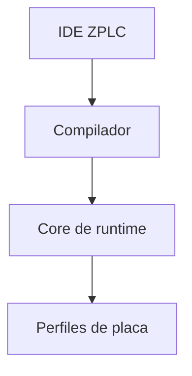

# Panorama de plataforma

ZPLC (Zephyr PLC) combina un core de ejecución ANSI C99 portable con herramientas de ingeniería TypeScript. Sus capacidades están condicionadas por evidencia: la simulación host, los builds de target y los resultados HIL responden preguntas distintas.

## El ecosistema ZPLC

```mermaid
flowchart TB
  IDE[IDE ZPLC]
  Compiler[Compilador]
  Runtime[Core de runtime]
  Boards[Perfiles de placa]

  IDE --> Compiler
  Compiler --> Runtime
  Runtime --> Boards
```

## Principios centrales

- **Memoria acotada en runtime**: el core C99 usa límites de memoria definidos; la validación sigue siendo parte de cada perfil de destino.
- **Separación mediante HAL**: el core y los adaptadores de hardware se separan para inspeccionar y probar cada comportamiento de plataforma de forma independiente.
- **Evidencia antes que claims**: timing del scheduler, I/O, persistencia, protocolos y soporte de placas sólo se afirman para el perfil/revisión con evidencia correspondiente.

## Fronteras de producto

1. **Core VM (`libzplc_core`)**: intérprete de bytecode C99, validación de programas, estado de runtime e interfaces de scheduler.
2. **Capa de abstracción de hardware (HAL)**: adaptadores para facilidades de plataforma como relojes, almacenamiento, I/O y transportes configurados.
3. **Compilador**: transforma flujos de proyecto soportados—centrados en Structured Text—en bytecode `.zplc`.
4. **IDE**: superficie de ingeniería de escritorio para autoría, diagnósticos y flujos de runtime según capacidades.

## Flujo típico

1. Elegí un target de proyecto e inspeccioná su perfil de placa/capacidades.
2. Escribí lógica en un flujo de lenguaje soportado y compilala a `.zplc`.
3. Usá simulación POSIX nativa para checks lógicos repetibles en host dentro de sus capacidades declaradas.
4. Construí firmware, flashealo, desplegá el programa PLC y operalo como acciones humanas separadas.
5. Usá evidencia target o HIL de la placa/revisión exactas antes de depender de timing o comportamiento físico.

## Continuá con

- [Primeros pasos](../getting-started/index.md)
- [Ejemplos de lenguajes](../languages/examples/v1-5-language-suite.md)
- [Arquitectura del sistema](../architecture/index.md)
