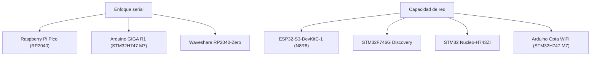

# Placas Soportadas

:::note
Esta página se genera desde `firmware/app/boards/boards.json`, el único manifiesto de placas. Actualizá el JSON o volvé a ejecutar `python3 tools/docs/generate_board_reference.py` en lugar de editar este archivo manualmente.
:::

## Topología

```mermaid
flowchart TD
  serial["Enfoque serial"]
  network["Capacidad de red"]
  b1["Raspberry Pi Pico (RP2040)"]
  serial --> b1
  b2["Arduino GIGA R1 (STM32H747 M7)"]
  serial --> b2
  b3["ESP32-S3-DevKitC-1 (N8R8)"]
  network --> b3
  b4["STM32F746G Discovery"]
  network --> b4
  b5["STM32 Nucleo-H743ZI"]
  network --> b5
  b6["Arduino Opta WiFi (STM32H747 M7)"]
  network --> b6
  b7["Waveshare RP2040-Zero"]
  serial --> b7
```

## La descripción de E/S

Cada entrada de placa del manifiesto tiene un objeto `io` que lista los canales de la placa. Un canal tiene un `id`, una `direction` (`input` u `output`), un `kind` (`digital` o `analog`), la `address` IEC de su lugar en la imagen de proceso (`%QX0.0`, `%IW4`), el `pin` o borne impreso en la placa, sus notas `electrical`, el valor `safe` de una salida y un objeto `dt` con el alias de devicetree, el controlador GPIO y el pin (o el conversor y el canal) que el build verifica.

`pin_status` dice de dónde sale el pin: `devicetree` es un pin que el devicetree de la placa o el overlay del perfil define y el build comprueba; `profile` es un pin de header que este perfil eligió y que necesita el banco de lazo de HIL-010 para confirmarse.

Para agregar un canal a una placa, agregá el alias a su overlay y la entrada a su descripción. La tabla de E/S del firmware se genera desde la descripción al compilar, así que ningún fuente C cambia, y el build falla cuando la descripción y el devicetree no coinciden. Una palabra de la imagen de proceso que ningún pin maneja no es un canal: un proyecto la lista en `io.virtual`.

Studio lee el mismo archivo. El editor de mapeo de E/S de la configuración del proyecto lista los canales de la placa seleccionada con sus nombres de pin y marca una fila en una dirección que la placa no tiene; un build falla con un error que nombra la placa y la variable cuando una variable está ubicada donde la placa no tiene canal; y un despliegue a hardware se rechaza, con un mensaje que nombra la placa, cuando el firmware informa otra descripción o el programa toca una dirección sin canal.

## Matriz de placas

| Nombre visible | Board ID | IDE ID | Target Zephyr | Red | Nivel de soporte | Registros de evidencia |
| --- | --- | --- | --- | --- | --- | --- |
| Raspberry Pi Pico (RP2040) | `rpi-pico-rp2040` | `rpi_pico` | `rpi_pico/rp2040` | Enfoque serial | cross-build | 0 |
| Arduino GIGA R1 (STM32H747 M7) | `arduino-giga-r1-m7` | `arduino_giga_r1` | `arduino_giga_r1/stm32h747xx/m7` | Enfoque serial | cross-build | 0 |
| ESP32-S3-DevKitC-1 (N8R8) | `esp32-s3-devkitc` | `esp32s3_devkitc` | `esp32s3_devkitc/esp32s3/procpu` | Capacidad de red (Wi-Fi) | cross-build | 0 |
| STM32F746G Discovery | `stm32f746g-disco` | `stm32f746g_disco` | `stm32f746g_disco/stm32f746xx` | Capacidad de red (Ethernet) | cross-build | 0 |
| STM32 Nucleo-H743ZI | `nucleo-h743zi` | `nucleo_h743zi` | `nucleo_h743zi/stm32h743xx` | Capacidad de red (Ethernet) | cross-build | 0 |
| Arduino Opta WiFi (STM32H747 M7) | `arduino-opta-wifi-m7` | `arduino_opta_wifi` | `arduino_opta/stm32h747xx/m7` | Capacidad de red (Wi-Fi) | cross-build | 0 |
| Waveshare RP2040-Zero | `waveshare-rp2040-zero` | `waveshare_rp2040_zero` | `rp2040_zero/rp2040` | Enfoque serial | cross-build | 0 |

## Huella de memoria

Flash y RAM de `firmware/app` por placa, de la tabla de memoria del enlazador en el reporte de tamaño de CI (`tools/firmware-test/size-budget.json`). Son mediciones de compilación en host, no evidencia de hardware. Las últimas tres columnas son las regiones de memoria que el runtime configura para la placa (trabajo, retentiva, código).

| Board ID | Flash (KiB) | Flash budget (KiB) | RAM (KiB) | RAM budget (KiB) | Work (KiB) | RETAIN (KiB) | Code (KiB) |
| --- | ---: | ---: | ---: | ---: | ---: | ---: | ---: |
| `rpi-pico-rp2040` | 151.5 | 159.2 | 199.9 | 210.0 | 8.0 | 4.0 | 24.0 |
| `arduino-giga-r1-m7` | 199.1 | 209.2 | 287.7 | 302.2 | 8.0 | 4.0 | 44.0 |
| `esp32-s3-devkitc` | 981.8 | 1031.0 | 2374.2 | 2493.0 | 2.0 | 1.0 | 8.0 |
| `stm32f746g-disco` | 282.8 | 297.0 | 230.2 | 241.8 | 8.0 | 4.0 | 16.0 |
| `nucleo-h743zi` | 414.3 | 435.0 | 478.0 | 502.0 | 8.0 | 4.0 | 44.0 |
| `arduino-opta-wifi-m7` | 434.0 | 455.8 | 458.4 | 481.5 | 8.0 | 4.0 | 32.0 |
| `waveshare-rp2040-zero` | 156.4 | 164.5 | 200.7 | 210.8 | 8.0 | 4.0 | 24.0 |

## Detalle por placa

### Raspberry Pi Pico (RP2040)

- **Board ID:** `rpi-pico-rp2040`
- **IDE ID:** `rpi_pico`
- **Zephyr target:** `rpi_pico/rp2040`
- **Variant:** `rp2040`
- **Network:** Enfoque serial
- **Nivel de soporte:** cross-build (sin registro de hardware)
- **Watchdog de hardware:** apagado: sin registro de hardware (HIL-010), el perfil lo mantiene apagado hasta que el tiempo de reinicio y las salidas seguras se registren en esta placa con él encendido
- **Comando de build:** `west build -b rpi_pico/rp2040 firmware/app --pristine`
- **Ancla de referencia:** `docs/docs/reference/capabilities-evidence.md`
- **Imagen de proceso usada (entrada, salida):** 18 B, 1 B
- **Hash de la descripción de E/S:** `d27196be`
- **Assets de soporte:**
  - `firmware/app/boards/rpi_pico_rp2040.conf`
  - `firmware/app/boards/rpi_pico_rp2040.overlay`

#### Canales de E/S

| Canal | Dirección | Tipo | Dirección IEC | Pin | Ubicación | Estado del pin | Seguro | Eléctrico |
| --- | --- | --- | --- | --- | --- | --- | --- | --- |
| DO0 | salida | digital | `%QX0.0` | GP0 | header pin 1 | devicetree | 0 | 3.3 V logic. Not 5 V tolerant. RP2040 drive strength is configurable up to 12 mA per pin (datasheet, not qualified here). |
| DO1 | salida | digital | `%QX0.1` | GP1 | header pin 2 | devicetree | 0 | 3.3 V logic. Not 5 V tolerant. RP2040 drive strength is configurable up to 12 mA per pin (datasheet, not qualified here). |
| DO2 | salida | digital | `%QX0.2` | GP2 | header pin 4 | devicetree | 0 | 3.3 V logic. Not 5 V tolerant. RP2040 drive strength is configurable up to 12 mA per pin (datasheet, not qualified here). |
| DO3 | salida | digital | `%QX0.3` | GP3 | header pin 5 | devicetree | 0 | 3.3 V logic. Not 5 V tolerant. RP2040 drive strength is configurable up to 12 mA per pin (datasheet, not qualified here). |
| DO4 | salida | digital | `%QX0.4` | GP25 | on-board LED | devicetree | 0 | On-board green LED through its series resistor; not a field output. |
| DI0 | entrada | digital | `%IX0.0` | GP15 | header pin 20 | devicetree |  | 3.3 V logic input with the RP2040 internal pull-up enabled by the profile; connect a switch to GND. Not 5 V tolerant. |
| DI1 | entrada | digital | `%IX0.1` | GP14 | header pin 19 | profile |  | 3.3 V logic input with the RP2040 internal pull-up enabled by the profile; connect a switch to GND. Not 5 V tolerant. |
| DI2 | entrada | digital | `%IX0.2` | GP13 | header pin 17 | profile |  | 3.3 V logic input with the RP2040 internal pull-up enabled by the profile; connect a switch to GND. Not 5 V tolerant. |
| DI3 | entrada | digital | `%IX0.3` | GP12 | header pin 16 | profile |  | 3.3 V logic input with the RP2040 internal pull-up enabled by the profile; connect a switch to GND. Not 5 V tolerant. |
| AI0 | entrada | analógico | `%IW4` | GP26 (ADC0) | header pin 31 | devicetree |  | 0 V to 3.3 V on the ADC input; do not exceed 3.3 V. 0..4095 -> 0.0 a 3.3 V. |
| AI1 | entrada | analógico | `%IW5` | GP27 (ADC1) | header pin 32 | devicetree |  | 0 V to 3.3 V on the ADC input; do not exceed 3.3 V. 0..4095 -> 0.0 a 3.3 V. |
| AI2 | entrada | analógico | `%IW6` | GP28 (ADC2) | header pin 34 | devicetree |  | 0 V to 3.3 V on the ADC input; do not exceed 3.3 V. 0..4095 -> 0.0 a 3.3 V. |
| AI3 | entrada | analógico | `%IW7` | VSYS/3 (ADC3) | internal | devicetree |  | Internal: the supply voltage divided by 3, no external connection. 0..4095 -> 0.0 a 3.3 V. VSYS = 3 x the input voltage. |
| AI4 | entrada | analógico | `%IW8` | Temperature sensor (ADC4) | internal | devicetree |  | Internal die temperature sensor, no external connection. 0..4095 -> 0.0 a 3.3 V. RP2040 datasheet: T [degC] = 27 - (V - 0.706) / 0.001721 with V = raw * 3.3 / 4095. |

### Arduino GIGA R1 (STM32H747 M7)

- **Board ID:** `arduino-giga-r1-m7`
- **IDE ID:** `arduino_giga_r1`
- **Zephyr target:** `arduino_giga_r1/stm32h747xx/m7`
- **Variant:** `stm32h747xx/m7`
- **Network:** Enfoque serial
- **Nivel de soporte:** cross-build (sin registro de hardware)
- **Watchdog de hardware:** apagado: sin registro de hardware (HIL-010), el perfil lo mantiene apagado hasta que el tiempo de reinicio y las salidas seguras se registren en esta placa con él encendido
- **Comando de build:** `west build -b arduino_giga_r1/stm32h747xx/m7 firmware/app --pristine`
- **Ancla de referencia:** `docs/docs/reference/capabilities-evidence.md`
- **Imagen de proceso usada (entrada, salida):** 1 B, 1 B
- **Hash de la descripción de E/S:** `77271dae`
- **Assets de soporte:**
  - `firmware/app/boards/arduino_giga_r1_stm32h747xx_m7.conf`
  - `firmware/app/boards/arduino_giga_r1_stm32h747xx_m7.overlay`

#### Canales de E/S

| Canal | Dirección | Tipo | Dirección IEC | Pin | Ubicación | Estado del pin | Seguro | Eléctrico |
| --- | --- | --- | --- | --- | --- | --- | --- | --- |
| DO0 | salida | digital | `%QX0.0` | PI12 (red LED) |  | devicetree | 0 | On-board LED, active low in the board devicetree; not a field output. |
| DO1 | salida | digital | `%QX0.1` | PJ13 (green LED) |  | devicetree | 0 | On-board LED, active low in the board devicetree; not a field output. |
| DI0 | entrada | digital | `%IX0.0` | PC13 (user button) |  | devicetree |  | On-board user button. |

### ESP32-S3-DevKitC-1 (N8R8)

- **Board ID:** `esp32-s3-devkitc`
- **IDE ID:** `esp32s3_devkitc`
- **Zephyr target:** `esp32s3_devkitc/esp32s3/procpu`
- **Variant:** `esp32s3/procpu`
- **Network:** Capacidad de red (Wi-Fi)
- **Nivel de soporte:** cross-build (sin registro de hardware)
- **Módulo:** ESP32-S3-WROOM-1-N8R8, 8 MB flash, 8 MB PSRAM (variante por confirmar en el módulo)
- **Watchdog de hardware:** apagado: sin registro de hardware (HIL-010), el perfil lo mantiene apagado hasta que el tiempo de reinicio y las salidas seguras se registren en esta placa con él encendido
- **Comando de build:** `west build -b esp32s3_devkitc/esp32s3/procpu firmware/app --pristine`
- **Ancla de referencia:** `docs/docs/reference/capabilities-evidence.md`
- **Imagen de proceso usada (entrada, salida):** 10 B, 1 B
- **Hash de la descripción de E/S:** `2e9abb09`
- **Assets de soporte:**
  - `firmware/app/boards/esp32s3_devkitc_esp32s3_procpu.conf`
  - `firmware/app/boards/esp32s3_devkitc_esp32s3_procpu.overlay`

#### Canales de E/S

| Canal | Dirección | Tipo | Dirección IEC | Pin | Ubicación | Estado del pin | Seguro | Eléctrico |
| --- | --- | --- | --- | --- | --- | --- | --- | --- |
| DO0 | salida | digital | `%QX0.0` | GPIO38 | header J3 | devicetree | 0 | 3.3 V logic. Not 5 V tolerant. External LED with a series resistor. |
| DO1 | salida | digital | `%QX0.1` | GPIO15 | header J1 | devicetree | 0 | 3.3 V logic. Not 5 V tolerant. |
| DO2 | salida | digital | `%QX0.2` | GPIO16 | header J1 | profile | 0 | 3.3 V logic. Not 5 V tolerant. |
| DO3 | salida | digital | `%QX0.3` | GPIO17 | header J1 | profile | 0 | 3.3 V logic. Not 5 V tolerant. |
| DI0 | entrada | digital | `%IX0.0` | GPIO0 (BOOT) | header J3 and BOOT button | devicetree |  | BOOT button, active low with an internal pull-up. A strapping pin: keep it high at reset. |
| DI1 | entrada | digital | `%IX0.1` | GPIO18 | header J1 | profile |  | 3.3 V logic. Not 5 V tolerant. Internal pull-up; connect a switch to GND. |
| DI2 | entrada | digital | `%IX0.2` | GPIO8 | header J1 | profile |  | 3.3 V logic. Not 5 V tolerant. Internal pull-up; connect a switch to GND. |
| DI3 | entrada | digital | `%IX0.3` | GPIO9 | header J1 | profile |  | 3.3 V logic. Not 5 V tolerant. Internal pull-up; connect a switch to GND. |
| AI0 | entrada | analógico | `%IW4` | GPIO4 (ADC1 channel 3) | header J1 | profile |  | 0 V to about 3.1 V at 11 dB attenuation; do not exceed 3.3 V. 0..4095 -> 0.0 a 3.1 V. Nominal and uncalibrated: the ESP32-S3 converter is nonlinear near both ends. |

#### Sin mapear

- `GPIO48 (RGB LED)`: the on-board LED is an addressable RGB part that needs the LED-strip driver

### STM32F746G Discovery

- **Board ID:** `stm32f746g-disco`
- **IDE ID:** `stm32f746g_disco`
- **Zephyr target:** `stm32f746g_disco/stm32f746xx`
- **Variant:** `stm32f746xx`
- **Network:** Capacidad de red (Ethernet)
- **Nivel de soporte:** cross-build (sin registro de hardware)
- **Watchdog de hardware:** apagado: sin registro de hardware (HIL-010), el perfil lo mantiene apagado hasta que el tiempo de reinicio y las salidas seguras se registren en esta placa con él encendido
- **Comando de build:** `west build -b stm32f746g_disco/stm32f746xx firmware/app --pristine`
- **Ancla de referencia:** `docs/docs/reference/capabilities-evidence.md`
- **Imagen de proceso usada (entrada, salida):** 1 B, 1 B
- **Hash de la descripción de E/S:** `80927f2e`
- **Assets de soporte:**
  - `firmware/app/boards/stm32f746g_disco.conf`
  - `firmware/app/boards/stm32f746g_disco.overlay`

#### Canales de E/S

| Canal | Dirección | Tipo | Dirección IEC | Pin | Ubicación | Estado del pin | Seguro | Eléctrico |
| --- | --- | --- | --- | --- | --- | --- | --- | --- |
| DO0 | salida | digital | `%QX0.0` | PI1 (LD1 green) |  | devicetree | 0 | On-board LED; not a field output. |
| DI0 | entrada | digital | `%IX0.0` | PI11 (user button) |  | devicetree |  | On-board user button. |

### STM32 Nucleo-H743ZI

- **Board ID:** `nucleo-h743zi`
- **IDE ID:** `nucleo_h743zi`
- **Zephyr target:** `nucleo_h743zi/stm32h743xx`
- **Variant:** `stm32h743xx`
- **Network:** Capacidad de red (Ethernet)
- **Nivel de soporte:** cross-build (sin registro de hardware)
- **Watchdog de hardware:** apagado: sin registro de hardware (HIL-010), el perfil lo mantiene apagado hasta que el tiempo de reinicio y las salidas seguras se registren en esta placa con él encendido
- **Comando de build:** `west build -b nucleo_h743zi/stm32h743xx firmware/app --pristine`
- **Ancla de referencia:** `docs/docs/reference/capabilities-evidence.md`
- **Imagen de proceso usada (entrada, salida):** 1 B, 1 B
- **Hash de la descripción de E/S:** `4193575e`
- **Assets de soporte:**
  - `firmware/app/boards/nucleo_h743zi.conf`
  - `firmware/app/boards/nucleo_h743zi.overlay`

#### Canales de E/S

| Canal | Dirección | Tipo | Dirección IEC | Pin | Ubicación | Estado del pin | Seguro | Eléctrico |
| --- | --- | --- | --- | --- | --- | --- | --- | --- |
| DO0 | salida | digital | `%QX0.0` | PB0 (LD1 green) |  | devicetree | 0 | On-board LED; not a field output. |
| DO1 | salida | digital | `%QX0.1` | PE1 (LD2 yellow) |  | devicetree | 0 | On-board LED; not a field output. |
| DI0 | entrada | digital | `%IX0.0` | PC13 (user button) |  | devicetree |  | On-board user button. |

### Arduino Opta WiFi (STM32H747 M7)

- **Board ID:** `arduino-opta-wifi-m7`
- **IDE ID:** `arduino_opta_wifi`
- **Zephyr target:** `arduino_opta/stm32h747xx/m7`
- **Variant:** `stm32h747xx/m7`
- **Network:** Capacidad de red (Wi-Fi)
- **Nivel de soporte:** cross-build (sin registro de hardware)
- **Watchdog de hardware:** apagado: sin registro de hardware (HIL-010), el perfil lo mantiene apagado hasta que el tiempo de reinicio y las salidas seguras se registren en esta placa con él encendido
- **Comando de build:** `west build -b arduino_opta/stm32h747xx/m7 firmware/app --pristine`
- **Ancla de referencia:** `docs/docs/reference/capabilities-evidence.md`
- **Imagen de proceso usada (entrada, salida):** 1 B, 1 B
- **Hash de la descripción de E/S:** `6ce9cc7a`
- **Assets de soporte:**
  - `firmware/app/boards/arduino_opta_stm32h747xx_m7.conf`
  - `firmware/app/boards/arduino_opta_stm32h747xx_m7.overlay`

#### Canales de E/S

| Canal | Dirección | Tipo | Dirección IEC | Pin | Ubicación | Estado del pin | Seguro | Eléctrico |
| --- | --- | --- | --- | --- | --- | --- | --- | --- |
| DO0 | salida | digital | `%QX0.0` | PI0 (status LED D0) |  | devicetree | 0 | On-board status LED; not a field output. |
| DO1 | salida | digital | `%QX0.1` | PI1 (status LED D1) |  | devicetree | 0 | On-board status LED; not a field output. |
| DO2 | salida | digital | `%QX0.2` | PI3 (status LED D2) |  | devicetree | 0 | On-board status LED; not a field output. |
| DO3 | salida | digital | `%QX0.3` | PH15 (status LED D3) |  | devicetree | 0 | On-board status LED; not a field output. |
| DO4 | salida | digital | `%QX0.4` | PI6 (relay output 1) | relay output terminal 1 | devicetree | 0 | Relay contact: it can switch a field circuit. Observe the contact rating in the Arduino Opta documentation; not qualified here. |
| DO5 | salida | digital | `%QX0.5` | PI5 (relay output 2) | relay output terminal 2 | devicetree | 0 | Relay contact: it can switch a field circuit. Observe the contact rating in the Arduino Opta documentation; not qualified here. |
| DO6 | salida | digital | `%QX0.6` | PI7 (relay output 3) | relay output terminal 3 | devicetree | 0 | Relay contact: it can switch a field circuit. Observe the contact rating in the Arduino Opta documentation; not qualified here. |
| DO7 | salida | digital | `%QX0.7` | PI4 (relay output 4) | relay output terminal 4 | devicetree | 0 | Relay contact: it can switch a field circuit. Observe the contact rating in the Arduino Opta documentation; not qualified here. |
| DI0 | entrada | digital | `%IX0.0` | PE4 (user button) |  | devicetree |  | On-board user button. |

#### Sin mapear

- `I1 to I8 (field inputs)`: the pin documentation of the Arduino Opta field inputs is not established (OA-13); the board devicetree defines no digital input alias for them

### Waveshare RP2040-Zero

- **Board ID:** `waveshare-rp2040-zero`
- **IDE ID:** `waveshare_rp2040_zero`
- **Zephyr target:** `rp2040_zero/rp2040`
- **Variant:** `rp2040`
- **Network:** Enfoque serial
- **Nivel de soporte:** cross-build (sin registro de hardware)
- **Watchdog de hardware:** apagado: sin registro de hardware (HIL-010), el perfil lo mantiene apagado hasta que el tiempo de reinicio y las salidas seguras se registren en esta placa con él encendido
- **Comando de build:** `west build -b rp2040_zero/rp2040 firmware/app --pristine`
- **Ancla de referencia:** `docs/docs/reference/capabilities-evidence.md`
- **Imagen de proceso usada (entrada, salida):** 1 B, 1 B
- **Hash de la descripción de E/S:** `0d5edb3c`
- **Assets de soporte:**
  - `firmware/app/boards/rp2040_zero_rp2040.conf`
  - `firmware/app/boards/rp2040_zero_rp2040.overlay`

#### Canales de E/S

| Canal | Dirección | Tipo | Dirección IEC | Pin | Ubicación | Estado del pin | Seguro | Eléctrico |
| --- | --- | --- | --- | --- | --- | --- | --- | --- |
| DO0 | salida | digital | `%QX0.0` | GP2 | castellated edge pad GP2 | devicetree | 0 | 3.3 V logic. Not 5 V tolerant. RP2040 drive strength is configurable up to 12 mA per pin (datasheet, not qualified here). |
| DI0 | entrada | digital | `%IX0.0` | GP3 | castellated edge pad GP3 | devicetree |  | 3.3 V logic input with the RP2040 internal pull-up enabled by the profile; connect a switch to GND. Not 5 V tolerant. |

#### Sin mapear

- `WS2812 RGB LED (GP16)`: an addressable LED needs the LED-strip driver; it is not a simple output
