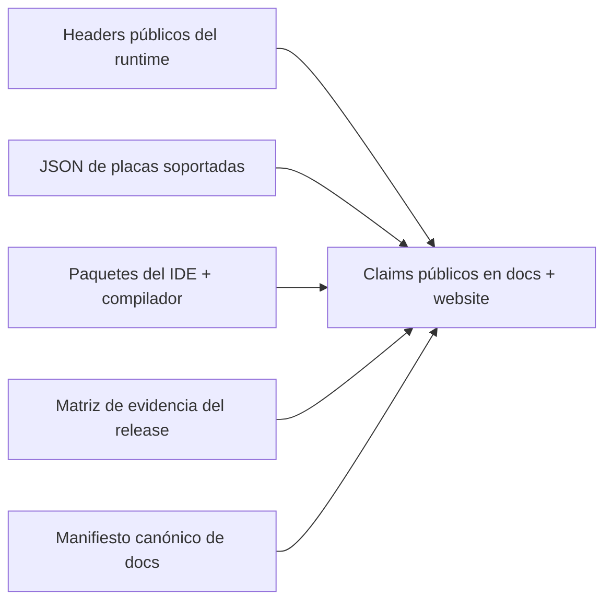

# Fuentes de Verdad

Esta página define de dónde puede obtener sus hechos la documentación de ZPLC v1.5.0.

## Pipeline de claims

## Fuentes canónicas por área

| Área del claim | Fuente canónica | Anclas del repositorio | Superficies documentales principales | Notas |
|---|---|---|---|---|
| API del runtime y comportamiento de memoria/scheduler | Headers públicos en C | `firmware/lib/zplc_core/include/zplc_core.h`, `zplc_scheduler.h`, `zplc_hal.h`, `zplc_isa.h`, `zplc_loader.h`, `zplc_debug.h`, `zplc_comm_dispatch.h` | `docs/docs/runtime/*`, `docs/docs/reference/runtime-api.md` | Si un comportamiento no aparece en headers públicos o en implementación/evidencia verificable, no se reclama para v1.5.0. |
| Placas soportadas | Manifiesto canónico de placas | `firmware/app/boards/supported-boards.v1.5.0.json` | `docs/docs/reference/boards.md`, `docs/docs/reference/index.md`, sección de placas en la landing | Nombres, IDE IDs, targets Zephyr, clase de red y nivel de validación deben coincidir exactamente con el JSON. |
| Workflow del IDE, soporte de lenguajes y versión del release | Paquete del IDE y workflows exportados | `packages/zplc-ide/package.json`, `packages/zplc-ide/src/compiler/index.ts`, `packages/zplc-ide/src/runtime/index.ts` | `docs/docs/ide/*`, `docs/docs/languages/*`, sección del IDE en la landing | Los claims de lenguajes tienen que coincidir con lo que realmente exportan y prueban los paquetes. |
| Preparación del release y gates con validación humana | Contrato de evidencia del release | `specs/008-release-foundation/artifacts/release-evidence-matrix.md` | `docs/docs/release-notes/index.md`, `docs/docs/reference/v1-5-canonical-docs-manifest.md`, `docs/docs/reference/source-of-truth.md` | Las docs pueden describir gates pendientes, pero las notas finales no pueden venderlos como completos sin evidencia. |
| Inventario de páginas bloqueantes del release | Manifiesto canónico de docs | `docs/docs/reference/v1-5-canonical-docs-manifest.md` | IA del sidebar, validación de paridad, planificación del release | Este archivo define qué páginas EN/ES deben existir antes del sign-off. |

## Mapeo por header

| Header | Qué autoriza a decir en la documentación |
|---|---|
| `zplc_core.h` | Modelo de instancias VM, responsabilidades de memoria compartida/privada, carga de código, APIs de ciclo de vida |
| `zplc_scheduler.h` | Modelo IEC de tareas, estados del scheduler, estadísticas de tareas, ciclo de registro/carga |
| `zplc_hal.h` | Contrato HAL, timing, GPIO/ADC/DAC, persistencia y servicios propiedad de la plataforma |
| `zplc_isa.h` | Constantes de versión y formato `.zplc`, layout de memoria, límites de stack y breakpoints, contrato ISA |
| `zplc_loader.h` | Semántica del loader para binarios `.zplc` y códigos de error |
| `zplc_comm_dispatch.h` | Tipos de FB de comunicación y vocabulario de estado para Modbus/MQTT/Azure/AWS/Sparkplug |
| `zplc_debug.h` | Modos de debug HIL, protocolo de trazas y claims de depuración controlables en runtime |

## Reglas para claims de placas

Usá `firmware/app/boards/supported-boards.v1.5.0.json` para todo lo siguiente:

- nombres visibles de placas
- IDE IDs
- targets de placa Zephyr
- assets de soporte
- clase e interfaz de red
- nivel de validación

No mantengas una segunda lista manual de placas en el website.

## Reglas para claims del IDE y compilador

Usá estas anclas del repositorio cuando documentes el workflow de desarrollo:

- `packages/zplc-ide/package.json` para la versión publicada y los scripts desktop/web
- `packages/zplc-ide/src/compiler/index.ts` para el soporte de lenguajes reclamado (`ST`, `IL`, `LD`, `FBD`, `SFC`)
- `packages/zplc-ide/src/runtime/index.ts` para los adapters exportados y las superficies de integración runtime/simulación

## Regla de evidencia del release

Las notas de versión, el soporte de placas y los claims del workflow deben cruzarse con:

- `specs/008-release-foundation/artifacts/release-evidence-matrix.md`

Si la matriz dice que un gate está pendiente, la documentación puede describirlo como pendiente o bloqueado; NUNCA como completo.

## Procedimiento de actualización

1. Cambiá primero el artefacto fuente.
2. Actualizá o generá la página documental afectada.
3. Actualizá el manifiesto canónico si cambió una superficie bloqueante del release.
4. Mantené alineadas estructuralmente las páginas en inglés y español.
5. Recién después actualizá la landing o los resúmenes públicos del release.
