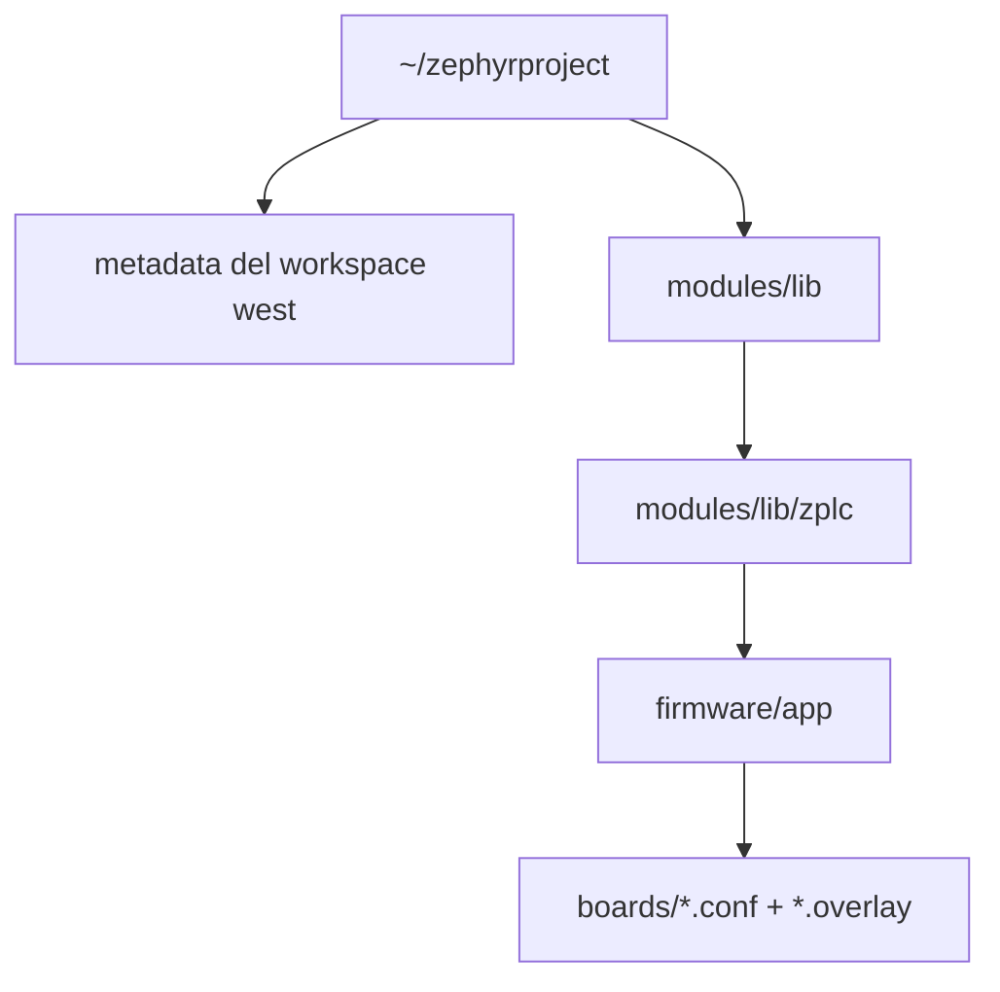

# Configuración del Workspace Zephyr

Esta página documenta el modelo canónico de workspace para v1.5 al compilar el runtime ZPLC con Zephyr.

Anclas autoritativas del repositorio para esta página:

- `firmware/app/CMakeLists.txt`
- `firmware/app/README.md`
- `firmware/app/boards/supported-boards.v1.5.0.json`
- `docs/docs/reference/source-of-truth.md`

## Para qué sirve esta página

Usá esta configuración cuando quieras compilar el runtime embebido contra placas soportadas por Zephyr. La lista canónica de placas y los comandos de build por placa salen de `firmware/app/boards/supported-boards.v1.5.0.json`.

## Forma canónica del workspace



El detalle importante es simple: la aplicación Zephyr publicada por este repo vive en `firmware/app`.

## Prerrequisitos

Antes de compilar firmware ZPLC, asegurate de tener:

1. una instalación del SDK/toolchain de Zephyr
2. `west` disponible en tu entorno
3. el entorno de Zephyr activado para que exista `ZEPHYR_BASE`

Ese requisito no es opcional: `firmware/app/CMakeLists.txt` llama a `find_package(Zephyr REQUIRED HINTS $ENV{ZEPHYR_BASE})`.

## Inicializar el workspace

Creá o reutilizá un workspace de Zephyr y después descargá sus dependencias:

```bash
west init ~/zephyrproject
cd ~/zephyrproject
west update
```

Cómo activás el entorno depende de cómo instalaste Zephyr. Antes de compilar ZPLC, verificá que `west` y la toolchain estén disponibles.

## Ubicar ZPLC dentro del workspace

Agregá este repositorio bajo el árbol de módulos:

```text
~/zephyrproject/modules/lib/zplc
```

Podés hacerlo de dos maneras:

- clonando/copiendo el repositorio dentro de `modules/lib/zplc`, o
- agregándolo al `west.yml` como checkout de módulo

## Compilar desde la raíz del repositorio

Una vez que el repo esté ubicado en `~/zephyrproject/modules/lib/zplc`, ejecutá los builds canónicos desde la raíz del repositorio ZPLC:

```bash
cd ~/zephyrproject/modules/lib/zplc
west build -b rpi_pico/rp2040 firmware/app --pristine
```

Esa forma coincide con el manifiesto de placas v1.5. Si algún collateral viejo difiere, priorizá el manifiesto.

## Targets canónicos v1.5

Estos son los targets Zephyr visibles para el release según `supported-boards.v1.5.0.json`:

| Placa | IDE ID | Target Zephyr | Comando canónico |
|---|---|---|---|
| Raspberry Pi Pico (RP2040) | `rpi_pico` | `rpi_pico/rp2040` | `west build -b rpi_pico/rp2040 firmware/app --pristine` |
| Arduino GIGA R1 (STM32H747 M7) | `arduino_giga_r1` | `arduino_giga_r1/stm32h747xx/m7` | `west build -b arduino_giga_r1/stm32h747xx/m7 firmware/app --pristine` |
| ESP32-S3 DevKitC | `esp32s3_devkitc` | `esp32s3_devkitc/esp32s3/procpu` | `west build -b esp32s3_devkitc/esp32s3/procpu firmware/app --pristine` |
| STM32F746G Discovery | `stm32f746g_disco` | `stm32f746g_disco` | `west build -b stm32f746g_disco firmware/app --pristine` |
| STM32 Nucleo-H743ZI | `nucleo_h743zi` | `nucleo_h743zi` | `west build -b nucleo_h743zi firmware/app --pristine` |

## Notas sobre flashing

Los comandos de build están canónicos en el manifiesto de placas. El flashing depende de cada placa:

- muchas placas pueden usar `west flash`
- los flujos UF2 de clase RP2040 pueden requerir copiar el artefacto generado al volumen de la placa

Cuando necesites detalles de flashing por placa, combiná esta página con los assets listados en el manifiesto de placas y con el README del runtime.

## Por qué esta página prioriza el manifiesto de placas

La regla de fuentes de verdad para v1.5 es explícita: los claims sobre placas soportadas y comandos públicos de build deben salir de `firmware/app/boards/supported-boards.v1.5.0.json`.

Entonces, para la documentación visible del release:

- usá el manifiesto para nombres de placas, IDE IDs, targets Zephyr y comandos de build
- usá `firmware/app` como path de aplicación
- no promociones paths de apps viejos como canónicos para v1.5

## Páginas relacionadas

- [Placas soportadas](./boards.md)
- [Fuentes de verdad](./source-of-truth.md)
- [API del Runtime](./runtime-api.md)
