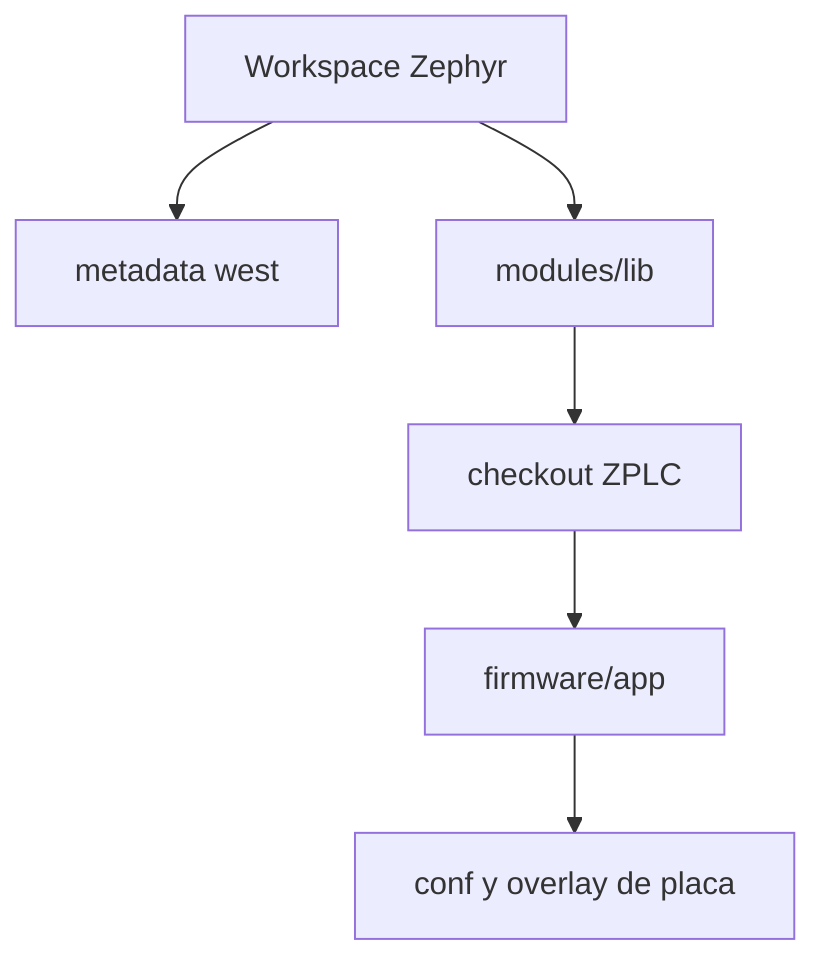

# Configuración del Workspace Zephyr

Compilá el runtime embebido desde los inputs del workspace Zephyr fijado por el
repositorio. Un cross-build exitoso sólo prueba que el profile compila; no prueba
flash, boot, I/O, timing, persistencia ni HIL.

## Camino rápido

1. Instalá SDK/toolchain Zephyr y dejá `west` disponible.
2. Activá el entorno Zephyr para que exista `ZEPHYR_BASE`.
3. Ubicá ZPLC en el workspace como checkout de módulo o clon.
4. Ejecutá el comando exacto de la página generada de [Profiles de placa](./boards.md).

## Anclas del repositorio

- `west.yml`
- `firmware/app/CMakeLists.txt`
- `firmware/app/README.md`
- `firmware/app/boards/supported-boards.v1.5.0.json` (nombre histórico)
- [Fuentes de verdad](./source-of-truth.md)

## Forma del workspace


```mermaid
flowchart TD
  ROOT[Workspace Zephyr]
  ROOT --> WEST[metadata west]
  ROOT --> MODULES[modules/lib]
  MODULES --> ZPLC[checkout ZPLC]
  ZPLC --> APP[firmware/app]
  APP --> BOARDS[conf y overlay de placa]
```

## Build

Después de activar el entorno, invocá el comando del profile generado desde la
raíz del repositorio. Por ejemplo:

```bash
west build -b rpi_pico/rp2040 firmware/app --pristine
```

La página generada de placas es la matriz vigente: contiene los seis profiles,
targets exactos, comandos de build, niveles de evidencia y cantidad de
referencias HIL. Cada entrada actual es `cross-build` con cero referencias HIL.

## Límite de flash y recovery

Build, flash, deploy de programa y RUN/debug son operaciones distintas. Usá el
procedimiento exacto de board/runner antes de flashear. No deduzcas que
cross-build hace seguro `west flash`, recovery o persistencia de programa en
un dispositivo no probado. Consultá [Límites de recuperación](../operations/recovery.md).

## Páginas relacionadas

- [Profiles de placa](./boards.md)
- [Capacidades y evidencia](./capabilities-evidence.md)
