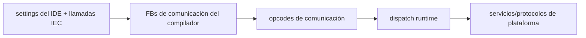

# Conectividad

Esta página describe la superficie de conectividad visible hoy en el repo y relevante para el release v1.5.0.

## Fuentes de verdad para claims de conectividad

- tipos de configuración del IDE en `packages/zplc-ide/src/types/index.ts`
- stdlib de comunicación del compilador en `packages/zplc-compiler/src/compiler/stdlib/communication.ts`
- vocabulario de dispatch runtime en `firmware/lib/zplc_core/include/zplc_comm_dispatch.h`

## Límite por capacidad de placa

La conectividad no depende solo del protocolo; también depende de la placa.

El manifiesto de placas soportadas clasifica boards como:

- serial-focused sin interfaz de red
- network-capable con Wi-Fi
- network-capable con Ethernet

## Configuración visible desde el IDE

`zplc.json` puede expresar hoy configuración para:

- Modbus RTU y Modbus TCP
- perfiles MQTT como Sparkplug B, generic broker, AWS IoT Core, Azure IoT Hub y Azure Event Grid MQTT
- tags/bindings de comunicación asociados a símbolos del proyecto

## Contrato compiler/runtime

En términos públicos, la conectividad fluye por tres capas:

## Modbus y MQTT dentro del alcance release

La matriz de evidencia trata el comportamiento de producto de **Modbus RTU/TCP y MQTT** como el gate de protocolos `REL-003`.

La línea honesta para v1.5 es:

- esos protocolos forman parte del scope público del producto
- el repo ya tiene superficies de IDE/compilador/runtime para ellos
- el sign-off final todavía depende de evidencia automática y humana que coincida

## Qué no conviene sobre-vender

Aunque los tipos del IDE ya incluyen opciones orientadas a AWS/Azure y el compilador/runtime ya nombran wrappers cloud, eso NO significa que todas esas rutas deban venderse como totalmente aprobadas para v1.5.

Si el gate de evidencia sigue pendiente, la documentación tiene que decirlo sin vueltas.
