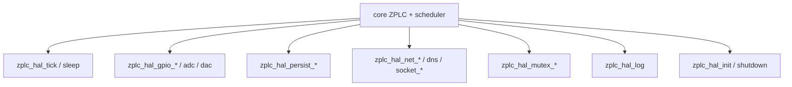

# Contrato HAL

`firmware/lib/zplc_core/include/zplc_hal.h` es el contrato público entre el core de ZPLC y cualquier plataforma concreta.

Eso incluye targets Zephyr, runtimes host/POSIX, shims WASM y futuros ports de placa.

## Regla central

El core portable no debería tocar APIs de plataforma de forma directa.

Si algo pertenece a GPIO, timing, persistencia, networking, sockets o sincronización, el core tiene que consumirlo mediante `zplc_hal_*`.

## Superficie HAL por responsabilidad

## Timing

- `zplc_hal_tick()` provee el reloj del scheduler en milisegundos
- `zplc_hal_sleep()` ofrece espera bloqueante fuera de la lógica PLC

## E/S digital y analógica

La superficie pública actual es por canales lógicos:

- `zplc_hal_gpio_read()`
- `zplc_hal_gpio_write()`
- `zplc_hal_adc_read()`
- `zplc_hal_dac_write()`

## Persistencia

La HAL es dueña de:

- `zplc_hal_persist_save()`
- `zplc_hal_persist_load()`
- `zplc_hal_persist_delete()`

## Red y sockets

La superficie pública de red incluye:

- `zplc_hal_net_init()`
- `zplc_hal_net_get_ip()`
- `zplc_hal_dns_resolve()`
- `zplc_hal_socket_connect()`
- `zplc_hal_socket_send()`
- `zplc_hal_socket_recv()`
- `zplc_hal_socket_close()`

## Sincronización

El contrato también incluye mutexes:

- `zplc_hal_mutex_create()`
- `zplc_hal_mutex_lock()`
- `zplc_hal_mutex_unlock()`

## Logging y ciclo de vida

- `zplc_hal_init()`
- `zplc_hal_shutdown()`
- `zplc_hal_log()`

## Regla práctica de documentación

Si una página del runtime describe comportamiento de plataforma que salta por afuera de este header, probablemente está mezclando capas.
