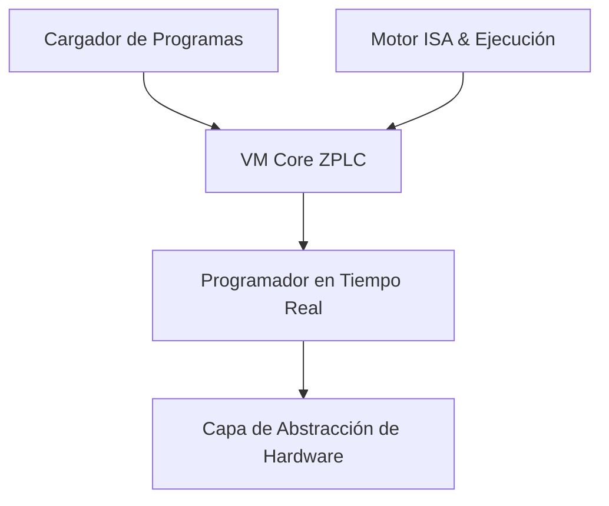

# Motor de Ejecución ZPLC

El runtime interno de ZPLC es el núcleo de ejecución de la plataforma. Diseñado específicamente para un rendimiento determinista en sistemas embebidos, ejecuta de manera segura el bytecode `.zplc`, gestiona la memoria, programa las tareas de automatización y se integra con el hardware específico de la plataforma.

## Responsabilidades Principales

El runtime ZPLC proporciona un entorno virtual completo adaptado para la ejecución de tareas IEC 61131-3. Sus responsabilidades incluyen:
- Cargar programas compilados `.zplc` y sus metadatos.
- Instanciar Máquinas Virtuales (VMs) con contextos de ejecución aislados.
- Hacer cumplir los límites de memoria estructural (Imágenes de Proceso, memoria interna de Trabajo, datos retenidos).
- Programar y orquestar tareas de PLC Cíclicas/Basadas en Eventos.
- Delegar las operaciones físicas de E/S, redes y almacenamiento hacia la Capa de Abstracción de Hardware (HAL) subyacente.

## Arquitectura de Subsistemas

## Modelo de Memoria Compartida

Para garantizar tanto la seguridad como el rendimiento en ICs con recursos limitados, el Contrato de Memoria del Runtime ZPLC define límites estrictos para los elementos de ejecución:
- **IPI** (Imagen de Proceso de Entradas): Búfer asignado y aislado para una lectura segura de entradas físicas.
- **OPI** (Imagen de Proceso de Salidas): Búfer que mapea los resultados lógicos a las salidas de hardware.
- **Work Memory** (Memoria de Trabajo): Pila de ejecución volátil y dinámica asignada durante el proceso en tiempo real.
- **Retain Memory** (Memoria Retenida): Memoria de estado persistida (no volátil) que rastrea los metadatos de los bloques y los valores `RETAIN`.

## Portabilidad de Target

Al asegurar que el runtime interno delegue los asuntos del hardware a un HAL estrictamente definido, ZPLC puede ejecutarse fácilmente en múltiples arquitecturas:
- **Zephyr RTOS**: La principal plataforma de ejecución para controladores edge de hardware. Ejecuta la aplicación del firmware de forma nativa en hardware bare-metal.
- **Simulación Nativa en Equipo Host**: Proveedor clásico de simulaciones SoftPLC de escritorio al adaptar funciones primitivas HAL de forma nativa para interactuar con sistemas operativos Mac, Windows y Linux.
