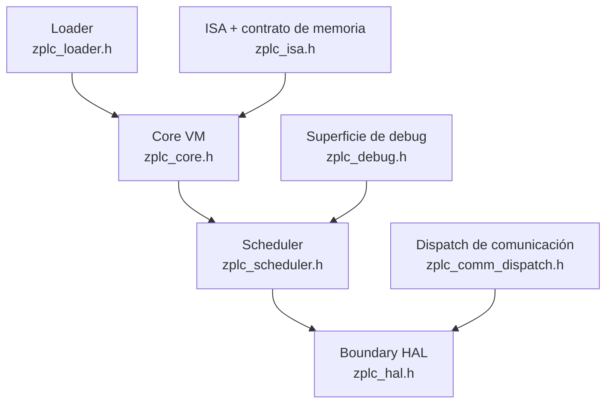
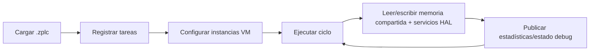

# Runtime y Sistemas Embebidos

El runtime ZPLC es el core de ejecución detrás de cualquier claim honesto de v1.5.0.

Es donde se carga el bytecode `.zplc`, se planifican las tareas, se coordina la memoria compartida
y se consumen los servicios de plataforma a través de la HAL en lugar de cablearlos directamente en el core.

## Responsabilidades del runtime

A nivel de contrato público, el runtime se encarga de:

- cargar programas `.zplc` y sus definiciones de tarea
- ofrecer instancias VM que ejecutan ciclos de bytecode
- coordinar regiones de memoria compartida como IPI, OPI, work, retain y code
- planificar tareas PLC con estadísticas, pause/resume y stepping
- delegar hardware, timing, persistencia y networking a la HAL

## Subsistemas principales

## Modelo de VM

`zplc_core.h` expone un modelo VM por instancias.

- cada `zplc_vm_t` lleva estado privado de ejecución como `pc`, `sp`, flags, profundidad de llamadas, breakpoints y stacks
- el código puede compartirse entre múltiples instancias VM
- la identidad y prioridad de tarea se adjuntan a la VM desde el scheduler

Eso le da a ZPLC una separación limpia entre **datos de proceso compartidos** y **contexto privado de ejecución**.

## Modelo de ejecución

En alto nivel, la ejecución del runtime sigue este ciclo:

1. inicializar la memoria runtime compartida
2. cargar código `.zplc` y metadatos de tareas
3. configurar una o más instancias VM para los entry points de cada tarea
4. planificar ciclos de tarea según intervalo y prioridad
5. interactuar con tiempo, I/O, persistencia y red mediante la HAL
6. exponer estado de debug, estadísticas e inspección de memoria a las herramientas de nivel superior

## Modelo de memoria compartida

El header ISA define el contrato de memoria del runtime.

- **IPI** arranca en `0x0000`
- **OPI** arranca en `0x1000`
- **Work memory** arranca en `0x2000`
- **Retain memory** arranca en `0x4000`
- **Code segment** arranca en `0x5000`

Lo importante no son solo los números. Lo importante es el contrato:

- las regiones de memoria del proceso y del runtime son explícitas
- la memoria retentiva es una parte de primera clase del contrato de la VM
- la memoria de código se carga y comparte en vez de estar incrustada en un único estado monolítico de ejecución

## Modelo del scheduler

`zplc_scheduler.h` expone el ciclo de vida público del scheduler:

- `zplc_sched_init()` / `zplc_sched_shutdown()`
- `zplc_sched_load()` para cargar binarios multitarea `.zplc`
- `zplc_sched_start()`, `stop()`, `pause()`, `resume()` y `step()`
- APIs de estadísticas e inspección de tareas
- lock/unlock explícitos para acceso a memoria compartida fuera del contexto de tarea

El header del scheduler también documenta la arquitectura actual orientada a Zephyr:

- timers disparan según los intervalos de tarea
- los callbacks envían work items a work queues por prioridad
- los threads de esas work queues ejecutan los ciclos PLC
- la memoria compartida se protege con primitivas de sincronización

## Targets soportados

El runtime se mantiene portable porque el core habla con el mundo exterior a través de la HAL.

Targets de validación en v1.5:

- **Zephyr RTOS**: target embebido principal
- **runtime host nativo**: camino de simulación nativa respaldado por Electron
- **WASM**: camino de simulación en navegador del IDE

Los claims concretos de placas no se definen acá. Vienen del manifiesto de placas soportadas y de la sección de referencia.

## Lo que el runtime no posee

El runtime **no** es dueño de:

- la UX del editor
- la ergonomía de autoría del proyecto
- los claims públicos de release
- la política de drivers específicos de hardware fuera del límite HAL/runtime app

Todo eso vive en las capas de IDE, docs y aplicación runtime objetivo.

## Referencias detalladas

- [Capa de Abstracción de Hardware](./hal-contract.md)
- [Modelo de Memoria](./memory-model.md)
- [Scheduler](./scheduler.md)
- [Conectividad](./connectivity.md)
- [Bloques de Función de Comunicación](./communication-function-blocks.md)
- [ISA del Runtime](./isa.md)
- [Persistencia y Memoria Retentiva](./persistence.md)
- [C Nativo en el Runtime](./native-c.md)
