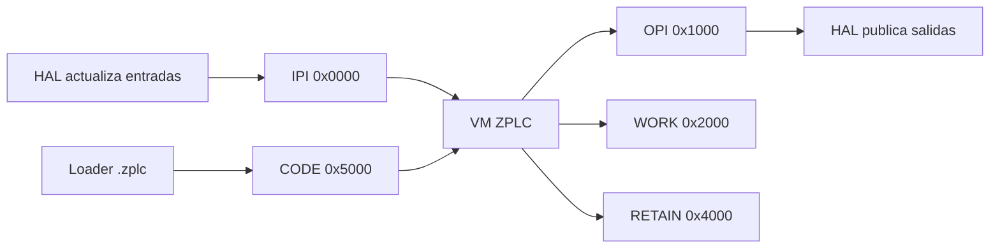

# ISA del Runtime

La fuente canónica para esta página es `firmware/lib/zplc_core/include/zplc_isa.h`.

En ZPLC v1.5.0, el release usa ese contrato público para definir:

- el layout de memoria de la VM
- los registros reservados del sistema
- la familia de opcodes válidos
- los IDs de tipos compartidos y sus límites
- el formato binario `.zplc`

## Qué fija el header hoy

`zplc_isa.h` expone actualmente estas constantes de versión del contrato ISA:

- `ZPLC_VERSION_MAJOR = 1`
- `ZPLC_VERSION_MINOR = 0`

Eso describe la **versión del contrato binario/ISA**, no la versión comercial completa del release.

## Layout de memoria de la VM

La ISA reserva cinco regiones lógicas con bases públicas y tamaños definidos por contrato:

| Región | Base | Tamaño | Fuente canónica |
|---|---:|---:|---|
| IPI (Input Process Image) | `0x0000` | `0x1000` (4 KiB) | `ZPLC_MEM_IPI_BASE`, `ZPLC_MEM_IPI_SIZE` |
| OPI (Output Process Image) | `0x1000` | `0x1000` (4 KiB) | `ZPLC_MEM_OPI_BASE`, `ZPLC_MEM_OPI_SIZE` |
| WORK | `0x2000` | configurable, default `0x2000` | `ZPLC_MEM_WORK_BASE`, `ZPLC_MEM_WORK_SIZE` |
| RETAIN | `0x4000` | configurable, default `0x1000` | `ZPLC_MEM_RETAIN_BASE`, `ZPLC_MEM_RETAIN_SIZE` |
| CODE | `0x5000` | configurable, default `0xB000` | `ZPLC_MEM_CODE_BASE`, `ZPLC_MEM_CODE_SIZE` |

## Registros de sistema reservados

Los últimos 16 bytes de la IPI (`0x0FF0` a `0x0FFF`) están reservados para información del scheduler/runtime:

| Registro | Dirección | Propósito |
|---|---:|---|
| `ZPLC_SYS_CYCLE_TIME` | `0x0FF0` | tiempo del último ciclo en microsegundos |
| `ZPLC_SYS_UPTIME` | `0x0FF4` | uptime del sistema en milisegundos |
| `ZPLC_SYS_TASK_ID` | `0x0FF8` | identificador de la tarea actual |
| `ZPLC_SYS_FLAGS` | `0x0FF9` | flags de estado del runtime |

Flags públicos definidos hoy:

- `ZPLC_SYS_FLAG_FIRST_SCAN`
- `ZPLC_SYS_FLAG_WDG_WARN`
- `ZPLC_SYS_FLAG_RUNNING`

## Familias de opcodes

La enumeración `zplc_opcode_t` agrupa las instrucciones públicas en familias claras:

| Familia | Ejemplos | Rol |
|---|---|---|
| Sistema | `OP_NOP`, `OP_HALT`, `OP_BREAK`, `OP_GET_TICKS` | control básico y depuración |
| Pila | `OP_DUP`, `OP_DROP`, `OP_SWAP`, `OP_OVER`, `OP_ROT` | manipulación del stack |
| Acceso indirecto | `OP_LOADI8`, `OP_LOADI16`, `OP_LOADI32`, `OP_STOREI8`, `OP_STOREI16`, `OP_STOREI32` | direccionamiento calculado |
| Strings | `OP_STRLEN`, `OP_STRCPY`, `OP_STRCAT`, `OP_STRCMP`, `OP_STRCLR` | operaciones seguras sobre `STRING` |
| Aritmética | `OP_ADD`, `OP_SUB`, `OP_MUL`, `OP_DIV`, `OP_MOD` | entero y punto flotante |
| Lógico/bitwise | `OP_AND`, `OP_OR`, `OP_XOR`, `OP_NOT`, `OP_SHL`, `OP_SHR`, `OP_SAR` | booleanos y bits |
| Comparación | `OP_EQ`, `OP_NE`, `OP_LT`, `OP_LE`, `OP_GT`, `OP_GE`, `OP_LTU`, `OP_GTU` | decisiones de control |
| Saltos y llamadas | `OP_JMP`, `OP_JZ`, `OP_JNZ`, `OP_CALL`, `OP_RET`, `OP_JR`, `OP_JRZ`, `OP_JRNZ` | flujo de ejecución |
| Conversión | `OP_I2F`, `OP_F2I`, `OP_I2B`, `OP_EXT8`, `OP_EXT16`, `OP_ZEXT8`, `OP_ZEXT16` | adaptación de tipos |
| Comunicación | `OP_COMM_EXEC`, `OP_COMM_STATUS`, `OP_COMM_RESET` | ejecución de FBs de comunicación |

La ISA también fija el tamaño del operando por rango de opcode:

- `0x00-0x3F`: sin operando
- `0x40-0x7F`: operando de 8 bits
- `0x80-0xBF`: operando de 16 bits
- `0xC0-0xFF`: operando de 32 bits

## Tipos y límites públicos

El header también publica límites que la toolchain y el runtime comparten:

- `ZPLC_STACK_MAX_DEPTH` para el stack de evaluación
- `ZPLC_CALL_STACK_MAX` para el stack de llamadas
- `ZPLC_MAX_BREAKPOINTS` para la capacidad de depuración
- IDs de tipos IEC como `ZPLC_TYPE_BOOL`, `ZPLC_TYPE_INT`, `ZPLC_TYPE_DINT`, `ZPLC_TYPE_REAL`, `ZPLC_TYPE_TIME` y `ZPLC_TYPE_STRING`

Para `STRING`, la ISA fija un layout seguro con:

- longitud actual en offset `0`
- capacidad máxima en offset `2`
- datos en offset `4`

## Contrato del archivo `.zplc`

El binario `.zplc` usa estructuras públicas empaquetadas en el mismo header:

- `zplc_file_header_t`
- `zplc_segment_entry_t`
- `zplc_task_def_t`
- `zplc_iomap_entry_t`
- `zplc_tag_entry_t`

Segmentos públicos definidos hoy:

- `ZPLC_SEG_CODE`
- `ZPLC_SEG_DATA`
- `ZPLC_SEG_BSS`
- `ZPLC_SEG_RETAIN`
- `ZPLC_SEG_IOMAP`
- `ZPLC_SEG_SYMTAB`
- `ZPLC_SEG_DEBUG`
- `ZPLC_SEG_TASK`
- `ZPLC_SEG_TAGS`

## Qué implica para la documentación v1.5

Cuando la documentación de v1.5 haga claims sobre bytecode, layout de memoria, límites de stack, breakpoints o formato `.zplc`, esos claims tienen que salir de `zplc_isa.h` y no de descripciones aspiracionales.

No documentes una ISA imaginaria que el header público todavía no define.

Para el contrato de carga del binario, complementá esta página con:

- [Visión general del runtime](/runtime)
- [Modelo de Memoria](/runtime/memory-model)
- [Runtime API](/reference/runtime-api)
- [Persistencia](/runtime/persistence)
- [Runtime nativo en C](/runtime/native-c)
