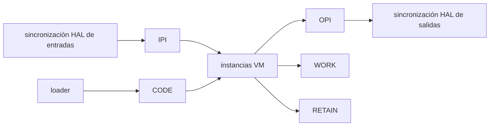

# Modelo de Memoria

El contrato público de memoria está definido sobre todo por:

- `firmware/lib/zplc_core/include/zplc_isa.h`
- `firmware/lib/zplc_core/include/zplc_core.h`

## Regiones lógicas de memoria

`zplc_isa.h` expone cinco regiones lógicas:

| Región | Base | Rol |
|---|---:|---|
| IPI | `0x0000` | process image de entradas |
| OPI | `0x1000` | process image de salidas |
| WORK | `0x2000` | memoria de trabajo |
| RETAIN | `0x4000` | memoria retentiva |
| CODE | `0x5000` | bytecode cargado |

## Estado compartido vs privado

`zplc_core.h` marca una separación muy importante.

### Compartido entre instancias VM

- IPI
- OPI
- espacio de direcciones work y retain
- segmento de código cargado

### Privado por instancia VM

- `pc`
- `sp`
- `bp`
- profundidad de llamadas
- flags y error
- breakpoints
- evaluation stack
- call stack

## Registros de sistema dentro de IPI

`zplc_isa.h` reserva los últimos 16 bytes de IPI para datos de sistema como:

- tiempo de ciclo
- uptime
- task id actual
- flags del runtime

## Límites acotados

Los headers públicos también exponen límites como:

- `ZPLC_STACK_MAX_DEPTH`
- `ZPLC_CALL_STACK_MAX`
- `ZPLC_MAX_BREAKPOINTS`
- tamaños configurables para work, retain y code

El README del runtime Zephyr también documenta claves `CONFIG_*` representativas para esos tamaños.

## Regla documental

Cuando hables de seguridad de memoria, determinismo, RETAIN o límites de stack, anclá el claim en estos contratos públicos. No inventes un segundo modelo de memoria en prosa.
