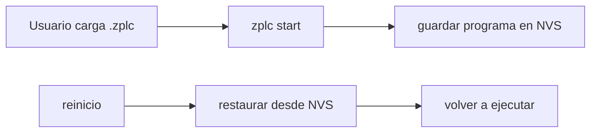

# Persistencia y Memoria Retentiva

La persistencia en ZPLC tiene dos niveles distintos:

1. **persistencia del programa `.zplc`** en el runtime embebido
2. **persistencia de datos `RETAIN`** a través del contrato `zplc_hal_persist_*`

Las fuentes canónicas para esta página son:

- `firmware/lib/zplc_core/include/zplc_hal.h`
- `firmware/lib/zplc_core/include/zplc_isa.h`
- `firmware/app/README.md`

## Contrato HAL de persistencia

El header público `zplc_hal.h` expone tres funciones para almacenamiento persistente:

- `zplc_hal_persist_save(const char *key, const void *data, size_t len)`
- `zplc_hal_persist_load(const char *key, void *data, size_t len)`
- `zplc_hal_persist_delete(const char *key)`

Ese es el límite correcto: el core depende del contrato HAL y no de una API directa de flash, filesystem o browser.

## Backends previstos por el contrato

Los comentarios públicos del HAL describen el mapeo esperado por plataforma:

| Plataforma | Backend esperado por contrato |
|---|---|
| embebido | NVS / EEPROM |
| desktop/host | archivo |
| WASM | `localStorage` |

En el runtime de referencia para Zephyr, `firmware/app/README.md` documenta el caso embebido con **NVS**.

## Persistencia del programa en Zephyr

El runtime de referencia para Zephyr documenta este flujo:



Comandos shell públicos documentados hoy:

```bash
zplc persist info
zplc persist clear
```

Según `firmware/app/README.md`:

- `zplc start` guarda automáticamente el programa en NVS
- en el próximo arranque, el runtime intenta restaurarlo automáticamente
- `zplc persist info` muestra si existe un programa guardado
- `zplc persist clear` borra el programa persistido

## Región RETAIN

`zplc_isa.h` reserva una región pública de memoria retentiva:

- base: `ZPLC_MEM_RETAIN_BASE = 0x4000`
- tamaño por defecto: `ZPLC_MEM_RETAIN_SIZE = 0x1000`
- el tamaño puede ajustarse por `CONFIG_ZPLC_RETAIN_MEMORY_SIZE`

Eso significa que la documentación puede reclamar con seguridad que existe una región lógica RETAIN en el contrato de la VM. Lo que cambia por plataforma es **cómo** se respalda físicamente esa región.

## Qué debe hacer una plataforma

Una implementación HAL correcta debe:

- guardar bloques persistentes por clave
- restaurarlos al arranque del runtime
- permitir borrar almacenamiento persistente cuando el operador lo pide

La forma exacta de sincronización depende de la plataforma. La documentación pública no debe inventar políticas de flush que no estén justificadas por implementación o evidencia.

## Reglas prácticas para documentación v1.5

- cuando hables de persistencia embebida, usá el runtime Zephyr de referencia y NVS
- cuando hables del core, describí el contrato HAL, no detalles internos no públicos
- cuando hables de `RETAIN`, anclá el claim en `zplc_isa.h`

## Relación con otras páginas

- [ISA del Runtime](/runtime/isa) define la región lógica `RETAIN`
- [Runtime API](/reference/runtime-api) documenta la API pública del HAL
- [Configuración del workspace Zephyr](/reference/zephyr-workspace-setup) cubre el entorno de build del runtime embebido
