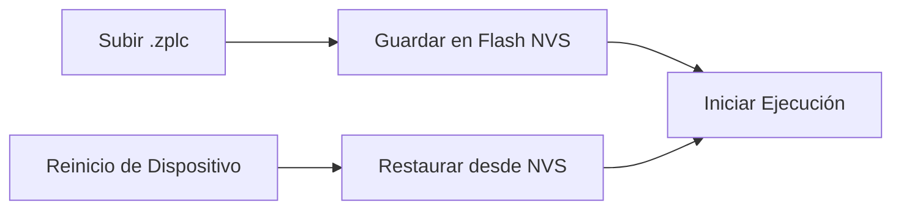

# Persistencia y Memoria Retenida

ZPLC asegura que tanto tu lógica compilada como las variables críticas de la máquina sobrevivan a un ciclo de encendido/apagado. Este modelo de persistencia depende de dos capas distintas:
1. Persistencia del bytecode `.zplc` desplegado.
2. Persistencia de datos `RETAIN`.

## Backends de Plataforma

El core del runtime ZPLC depende de una Capa de Abstracción de Hardware (HAL) abstracta para las operaciones de persistencia. Esto permite que el sistema se adapte sin problemas a las capacidades de almacenamiento de distintos entornos:

| Plataforma | Backend de Almacenamiento |
|---|---|
| **Hardware Zephyr** | NVS (Almacenamiento No Volátil) en Flash interna/externa en MCUs. |
| **Simulación Nativa (PC)** | Almacenamiento basado en archivos directamente en el SO anfitrión. |

## Persistencia de Programa en Hardware

Cuando se carga un binario `.zplc` desde el IDE a una placa objetivo, el runtime lo guarda en memoria no volátil (NVS).



Al iniciar, el runtime verifica automáticamente la NVS. Si se encuentra un binario ZPLC válido, se restaura automáticamente en memoria y la ejecución comienza al instante sin intervención manual.

## Memoria Retentiva (`RETAIN`)

ZPLC soporta completamente las variables `RETAIN` del estándar IEC 61131-3. Esta región de memoria se usa para preservar el estado operativo crítico (como setpoints, contadores de error y horas de funcionamiento de la máquina) a través de reinicios.

**Ejemplo de Implementación:**
```st
VAR RETAIN
    setpoint : REAL := 25.5;
    run_hours : UDINT;
END_VAR
```

Estas variables se ubican en un sector de memoria designado por el compilador ZPLC. El runtime rastrea las actualizaciones de esta región y la persiste a través de la HAL, asegurando que, incluso después de un corte de energía, tu proceso retome exactamente donde lo dejó.
