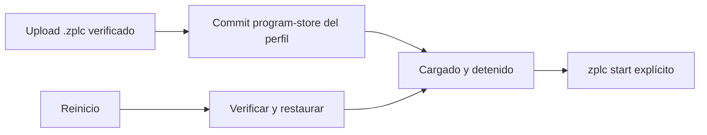

# Persistencia y Memoria Retenida

Para perfiles con un backend program-store habilitado y operativo, ZPLC puede
confirmar transaccionalmente un artefacto `.zplc` desplegado y verificado. El
restore publica el artefacto como lógicamente detenido/READY. El comportamiento
de las salidas antes de ejecutar es específico del perfil de target y requiere
evidencia registrada. Una persona debe ejecutar explícitamente `zplc start`.

## Backends de Plataforma

El core del runtime ZPLC depende de una Capa de Abstracción de Hardware (HAL) abstracta para las operaciones de persistencia. Esto permite que el sistema se adapte sin problemas a las capacidades de almacenamiento de distintos entornos:

| Plataforma | Backend de Almacenamiento |
|---|---|
| **Perfil Zephyr** | Backend program-store cuando está habilitado y operativo; NVS es una implementación, no una garantía universal de placa. |
| **Simulación Nativa (PC)** | Program-store basado en archivos usado por pruebas host. |

## Persistencia de Programa en Hardware

Cuando un perfil dispone de un backend program-store operativo, una carga
`.zplc` verificada puede confirmarse mediante ese backend.

```mermaid
flowchart LR
  Load[Upload .zplc verificado] --> Save[Commit program-store del perfil]
  Save --> Ready[Cargado y detenido]
  Boot[Reinicio] --> Restore[Verificar y restaurar]
  Restore --> Ready
  Ready --> Start[zplc start explícito]
```

Al iniciar, un program store habilitado puede proporcionar un artefacto válido
para verificación y restore lógicamente detenido/READY. El comportamiento de
las salidas antes de ejecutar es específico del perfil de target y requiere
evidencia registrada. El deploy termina al completar la carga verificada; nunca
arranca la máquina. El arranque es una operación humana separada y explícita.
La evidencia target, power-cut, HIL y eléctrica sigue siendo específica del
perfil exacto y no se ejecutó aquí.

## Memoria Retentiva (`RETAIN`)

ZPLC define una región de memoria `RETAIN` y primitivas HAL de persistencia. El
runtime POSIX tiene pruebas de persistencia host. Las declaraciones de fuente
`VAR RETAIN` y `VAR_GLOBAL RETAIN` se rechazan deliberadamente: todavía no
existe un contrato end-to-end de asignación, restore o persistencia calificada.

No uses `RETAIN` para estado crítico de recuperación. La región y las
primitivas HAL son capacidades internas, no evidencia de retención a nivel de
fuente o target. La evidencia target, power-cut y HIL sigue siendo necesaria
para el perfil exacto antes de que un futuro flujo de retención soportado pueda
declararse en commissioning.
