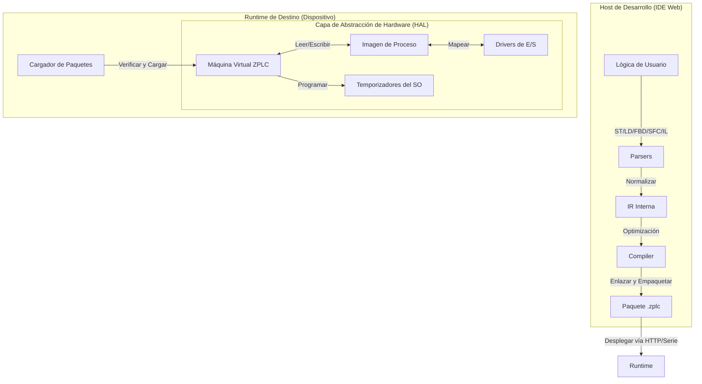

# ZPLC v1.0: Especificación Técnica y Arquitectura
**Versión:** 1.0.0 (Estable)
**Objetivo:** Automatización Industrial de Código Abierto
**Filosofía Central:** Un Núcleo de Ejecución, Cualquier Runtime.

## 1. Resumen Ejecutivo

ZPLC es un entorno de ejecución de PLC portátil y determinista impulsado por Zephyr RTOS para objetivos embebidos y capas de SO nativas para hosting en escritorio/servidor. Está diseñado para llevar las prácticas modernas de desarrollo de software, incluyendo pipelines de CI/CD, despliegue binario compacto e interoperabilidad abierta a través de PLCopen XML, a la planta industrial.

**La Promesa "v1":** Un runtime totalmente funcional que soporta los 5 lenguajes de la norma IEC 61131-3, capaz de ejecutar E/S de hardware real o simulaciones en el navegador, con determinismo de grado industrial.

---

## 2. Plataformas de Hardware Compatibles

ZPLC v1.0 soporta oficialmente las siguientes placas de referencia. Los pipelines de CI/CD deben asegurar que la compilación sea exitosa para todos los objetivos definidos.

| Nombre de la Placa | SoC | ID de Placa Zephyr | Notas |
| :--- | :--- | :--- | :--- |
| **Arduino GIGA R1** | STM32H747XI (Cortex-M7/M4) | `arduino_giga_r1_m7` | Dual-core (apuntando al M7) |
| **ESP32-S3 DevKit-C** | ESP32-S3 (Xtensa LX7) | `esp32s3_devkitc` | Capacidad WiFi/BLE |
| **STM32 Nucleo-H743ZI** | STM32H743ZI (Cortex-M7) | `nucleo_h743zi` | Ref. industrial de alto rendimiento |
| **Raspberry Pi Pico 2** | RP2350 (Cortex-M33) | `rpi_pico2` | (O fallback `rpi_pico`) |
| **QEMU (Simulación)** | Cortex-M3 | `mps2_an385` | CI por defecto |

---

## 3. Arquitectura de Alto Nivel

El sistema sigue una arquitectura "Compilador-VM". El IDE actúa como compilador/enlazador, produciendo un paquete de bytecode agnóstico al hardware (`.zplc`) que es consumido por el Núcleo ZPLC.

Para objetivos embebidos, **Zephyr RTOS es el ciudadano principal**. ZPLC está diseñado para ser un **Módulo de Zephyr** que puede ser incorporado sin esfuerzo en cualquier placa soportada por Zephyr.

### 2.1 El Flujo de Datos

---

## 4. El Núcleo ZPLC (Runtime)

El Núcleo está escrito en ANSI C99, cumpliendo estrictamente con el estándar, diseñado para ser compilado como una librería (`libzplc_core`).

### 4.1 La Máquina Virtual (VM)

* **Conjunto de Instrucciones:** Basado en pila, optimizado para lógica booleana y aritmética.
* **IR Unificada:** Los lenguajes Structured Text (ST) y Ladder (LD) se compilan finalmente en los mismos códigos de operación (opcodes) JUMP / LOAD / STORE / AND / OR.
* **Modelo de Memoria:**
    * **Imagen de Proceso:** Un bloque contiguo de memoria para snapshots de E/S.
    * **Memoria Retentiva:** Un bloque dedicado respaldado por almacenamiento HAL (RAM con batería / Flash).
    * **Memoria de Trabajo:** Pila/Heap para cálculos temporales (estrictamente acotada).

---

## 5. Capa de Abstracción de Hardware (HAL)

El Núcleo nunca llama al hardware directamente. Llama a la HAL.

### 5.1 Estrategia de Integración con Zephyr (Principal)

ZPLC se integra con Zephyr como un **Módulo**.
- **DeviceTree Bindings:** Los canales de E/S se definen en archivos overlay `.dts` usando un binding personalizado.
- **Kconfig:** Todos los límites de ejecución (tamaño de pila, pool de memoria) son configurables vía Kconfig.
- **Shell:** ZPLC proporciona un módulo de shell (`zplc load`, `zplc start`, `zplc stats`) para la gestión.
